# SocialFlow — Architecture Overview

## 1. Feature Map

The feature map describes **what SocialFlow provides to users**. Technical implementation details such as CQRS, Outbox Pattern, Hangfire, Redis, and SignalR are documented separately in the architecture sections.

```mermaid
flowchart LR

    %% ================= LEFT SIDE =================

    POST1["Create Post"] --> POST["Posts & News Feed"]
    POST2["Edit / Delete Post"] --> POST
    POST3["Post Detail"] --> POST
    POST4["News Feed"] --> POST
    POST5["Post Privacy"] --> POST
    POST6["Share Post"] --> POST
    POST7["Save Post"] --> POST
    POST8["Tag Users"] --> POST

    SOCIAL1["Send Friend Request"] --> SOCIAL["Social Graph"]
    SOCIAL2["Accept / Reject Request"] --> SOCIAL
    SOCIAL3["Remove Friend"] --> SOCIAL
    SOCIAL4["Friends List"] --> SOCIAL
    SOCIAL5["Friend Suggestions"] --> SOCIAL
    SOCIAL6["Follow / Unfollow"] --> SOCIAL
    SOCIAL7["Block User"] --> SOCIAL

    PROFILE1["View Profile"] --> PROFILE["Profile Management"]
    PROFILE2["Update Profile"] --> PROFILE
    PROFILE3["Avatar & Cover"] --> PROFILE
    PROFILE4["Personal Information"] --> PROFILE
    PROFILE5["Privacy Settings"] --> PROFILE

    COMMENT1["Create Comment"] --> COMMENT["Comments"]
    COMMENT2["Nested Replies"] --> COMMENT
    COMMENT3["View Comments"] --> COMMENT
    COMMENT4["Edit Comment"] --> COMMENT
    COMMENT5["Delete Comment"] --> COMMENT

    REACT1["React to Post"] --> REACTION["Reactions"]
    REACT2["React to Comment"] --> REACTION
    REACT3["Remove Reaction"] --> REACTION
    REACT4["Reaction Summary"] --> REACTION

    AUTH1["Register"] --> AUTH["Authentication & Account"]
    AUTH2["Login / Logout"] --> AUTH
    AUTH3["Email Verification"] --> AUTH
    AUTH4["Refresh Token"] --> AUTH
    AUTH5["Forgot / Reset Password"] --> AUTH
    AUTH6["Change Password"] --> AUTH

    MEDIA1["Upload Image"] --> MEDIA["Media"]
    MEDIA2["Upload Video"] --> MEDIA
    MEDIA3["Delete Media"] --> MEDIA
    MEDIA4["Media Gallery"] --> MEDIA

    %% ================= CENTER =================

    POST --> SF
    SOCIAL --> SF
    PROFILE --> SF
    COMMENT --> SF
    REACTION --> SF
    AUTH --> SF
    MEDIA --> SF

    SF["SocialFlow<br/>Social Networking Platform"]

    %% ================= RIGHT SIDE =================

    SF --> CHAT["Messaging"]
    SF --> GROUP["Groups"]
    SF --> STORY["Stories"]
    SF --> CALL["Voice & Video Calls"]
    SF --> NOTIFY["Notifications & Presence"]
    SF --> SEARCH["Search & Discovery"]

    CHAT --> CHAT1["Private Chat"]
    CHAT --> CHAT2["Group Chat"]
    CHAT --> CHAT3["Send Message"]
    CHAT --> CHAT4["Media / File Message"]
    CHAT --> CHAT5["Reply / React"]
    CHAT --> CHAT6["Read Receipts"]
    CHAT --> CHAT7["Typing Indicator"]
    CHAT --> CHAT8["Delete / Unsend"]

    GROUP --> GROUP1["Create Group"]
    GROUP --> GROUP2["Join / Leave Group"]
    GROUP --> GROUP3["Manage Members"]
    GROUP --> GROUP4["Roles & Permissions"]
    GROUP --> GROUP5["Group Posts"]
    GROUP --> GROUP6["Approve Posts"]
    GROUP --> GROUP7["Invite Members"]
    GROUP --> GROUP8["Group Settings"]

    STORY --> STORY1["Create Story"]
    STORY --> STORY2["View Stories"]
    STORY --> STORY3["Story Viewers"]
    STORY --> STORY4["React / Reply"]
    STORY --> STORY5["Story Expiration"]

    CALL --> CALL1["Voice Call"]
    CALL --> CALL2["Video Call"]
    CALL --> CALL3["Accept / Reject Call"]
    CALL --> CALL4["Call History"]
    CALL --> CALL5["Mute / Camera Control"]

    NOTIFY --> NOTIFY1["Notification Center"]
    NOTIFY --> NOTIFY2["Realtime Notifications"]
    NOTIFY --> NOTIFY3["Online Presence"]
    NOTIFY --> NOTIFY4["Last Seen"]
    NOTIFY --> NOTIFY5["Unread Counter"]

    SEARCH --> SEARCH1["Search Users"]
    SEARCH --> SEARCH2["Search Posts"]
    SEARCH --> SEARCH3["Search Groups"]
    SEARCH --> SEARCH4["People You May Know"]
    SEARCH --> SEARCH5["Trending Content"]

    %% ================= STYLES =================

    classDef root fill:#0F172A,stroke:#020617,stroke-width:4px,color:#FFFFFF,font-weight:bold;
    classDef domain fill:#0D9488,stroke:#0F766E,stroke-width:2px,color:#FFFFFF,font-weight:bold;
    classDef core fill:#2563EB,stroke:#1D4ED8,stroke-width:4px,color:#FFFFFF,font-weight:bold;
    classDef feature fill:#F1F5F9,stroke:#CBD5E1,stroke-width:1px,color:#0F172A;

    class SF root;
    class POST,CHAT core;
    class SOCIAL,PROFILE,COMMENT,REACTION,MEDIA,AUTH,GROUP,STORY,CALL,NOTIFY,SEARCH domain;

    class POST1,POST2,POST3,POST4,POST5,POST6,POST7,POST8 feature;
    class SOCIAL1,SOCIAL2,SOCIAL3,SOCIAL4,SOCIAL5,SOCIAL6,SOCIAL7 feature;
    class PROFILE1,PROFILE2,PROFILE3,PROFILE4,PROFILE5 feature;
    class COMMENT1,COMMENT2,COMMENT3,COMMENT4,COMMENT5 feature;
    class REACT1,REACT2,REACT3,REACT4 feature;
    class AUTH1,AUTH2,AUTH3,AUTH4,AUTH5,AUTH6 feature;
    class MEDIA1,MEDIA2,MEDIA3,MEDIA4 feature;
    class CHAT1,CHAT2,CHAT3,CHAT4,CHAT5,CHAT6,CHAT7,CHAT8 feature;
    class GROUP1,GROUP2,GROUP3,GROUP4,GROUP5,GROUP6,GROUP7,GROUP8 feature;
    class STORY1,STORY2,STORY3,STORY4,STORY5 feature;
    class CALL1,CALL2,CALL3,CALL4,CALL5 feature;
    class NOTIFY1,NOTIFY2,NOTIFY3,NOTIFY4,NOTIFY5 feature;
    class SEARCH1,SEARCH2,SEARCH3,SEARCH4,SEARCH5 feature;

    linkStyle default stroke:#94A3B8,stroke-width:1.4px;
```

---

## 2. Technical Architecture

The **Technology Architecture Diagram** is maintained separately in draw.io. It describes how the major technologies and architectural layers are connected.

### Core stack

| Area                      | Technology / Pattern                   |
| ------------------------- | -------------------------------------- |
| Client                    | React, Vite, TypeScript                |
| API                       | ASP.NET Core Web API                   |
| Application               | CQRS, MediatR                          |
| Domain                    | Entities, Value Objects, Domain Events |
| Persistence               | EF Core, PostgreSQL                    |
| Cache / Presence          | Redis                                  |
| Reliable async processing | Transactional Outbox Pattern           |
| Background jobs           | Hangfire                               |
| Realtime                  | SignalR                                |
| Media                     | Cloudinary                             |
| Authentication            | ASP.NET Core Identity, JWT             |

### Layer direction

```text
Client
  ↓
API Layer
  ↓
Application Layer
  ↓
Domain Layer

Infrastructure implements application/domain abstractions
and connects the application to PostgreSQL, Redis,
Cloudinary and other external services.
```

The technical architecture diagram should stay **high level**. Detailed request behavior belongs in the sequence diagrams below.

---

# 3. Request Flows

SocialFlow uses CQRS to separate state-changing operations (**Commands**) from read operations (**Queries**).

## 3.1 Command Flow — Synchronous Request

This sequence represents the part of a command that belongs to the HTTP request lifecycle. Example: sending a friend request, creating a post, or updating a profile.

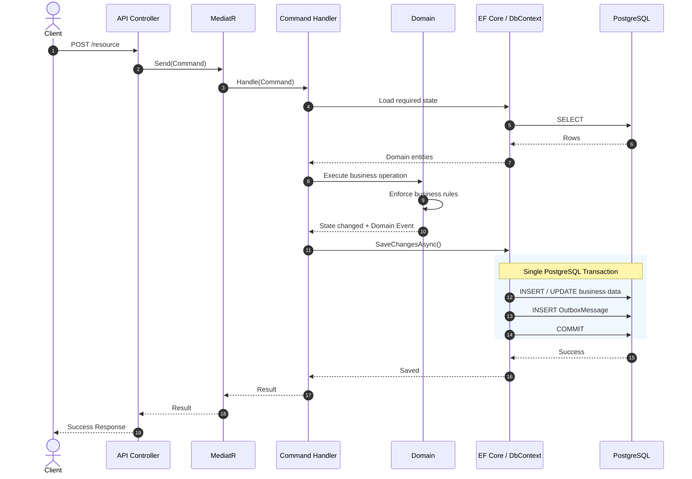


## 3.2 Command Flow — Asynchronous Outbox Processing

After the command transaction has committed, background processing handles the stored event independently from the original HTTP request.

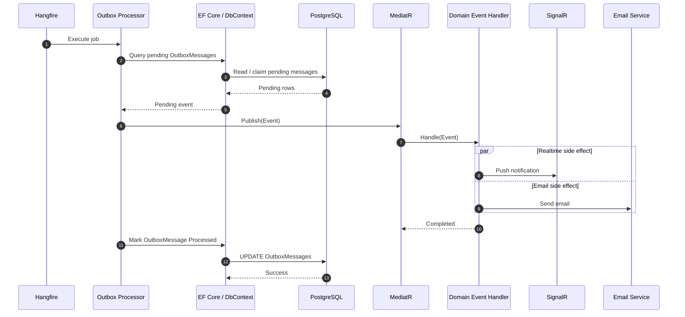

### Outbox lifecycle

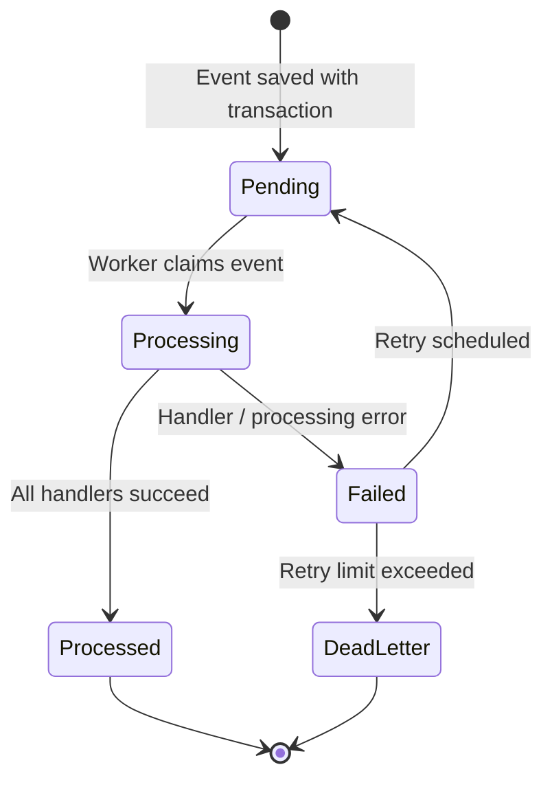
---

## 3.3 Query Flow

Queries do not modify domain state and do not generate outbox events. Read-heavy use cases can use Redis before falling back to PostgreSQL.

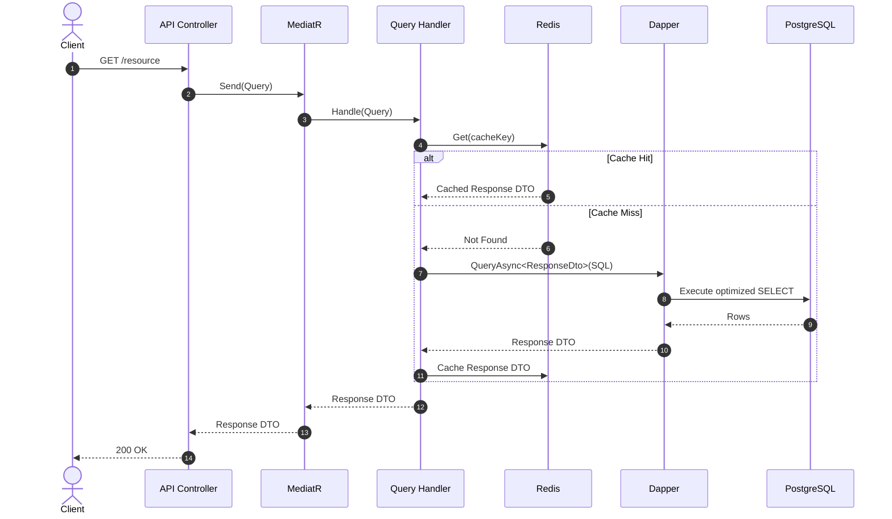
---

## 4. Use Case Diagrams

The following diagrams illustrate the key use cases of the SocialFlow platform, organized by major domain areas.

### 4.1 Content

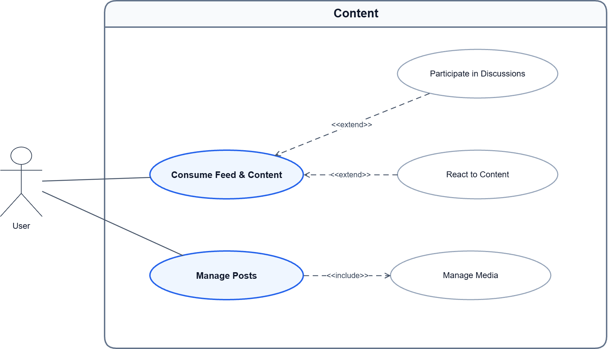


### 4.2 Messaging & Calls

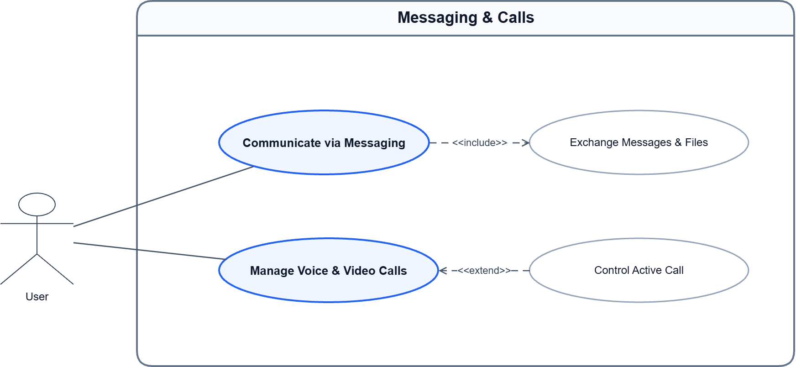

### 4.3 Notifications

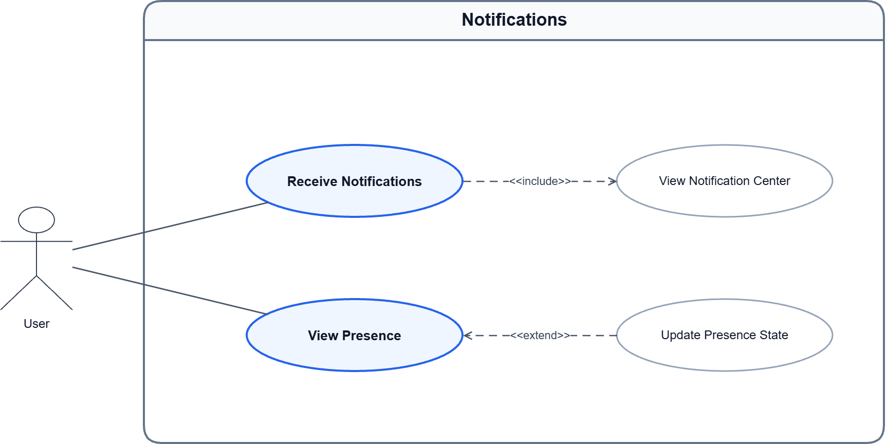


### 4.4 Account & Profile

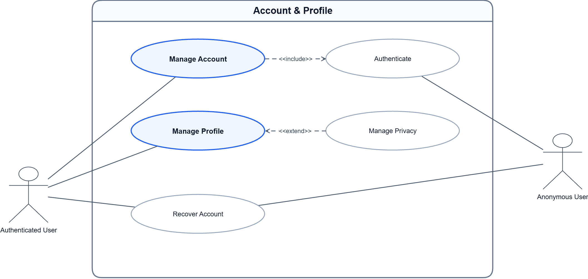


### 4.5 Social

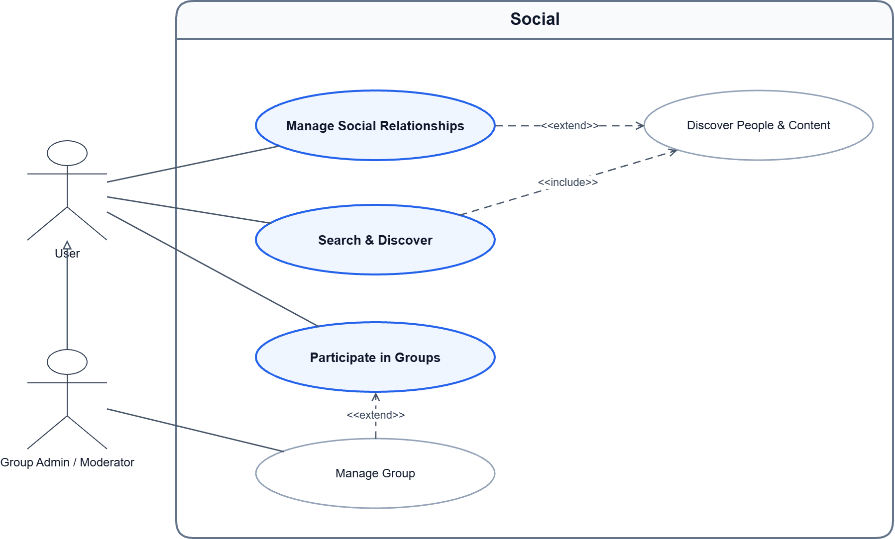

---

## 5. Sitemap

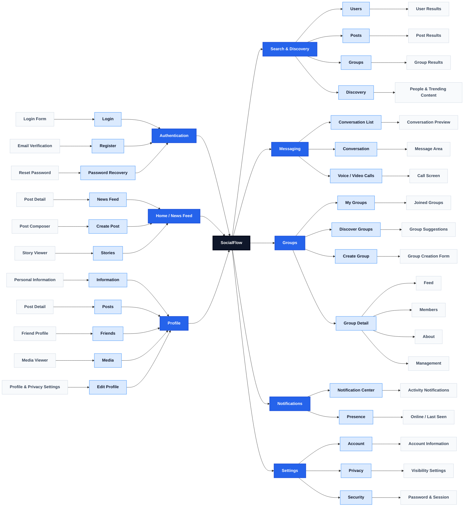
