# SocialFlow Architecture

Status: Draft
Architecture Style: Clean Architecture
Primary Patterns: CQRS, MediatR, Transactional Outbox, Repository
Pattern, Event-Driven Processing

### 1. System Overview

SocialFlow is a social networking platform built with ASP.NET Core and
React. The backend follows Clean Architecture to keep business rules
independent from frameworks and infrastructure.

### Technology Overview

| Area | Technology / Pattern |
|---|---|

| Frontend | React, Vite, TypeScript |
| Backend | API ASP.NET Core Web API |
| Architecture | Clean Architecture |
| Application | Pattern CQRS + MediatR |
| Persistence | EF Core + PostgreSQL |
| Cache | Redis |
| Reliable | Events Transactional Outbox Pattern |
| Background | Processing Hangfire |
| Real-time | SignalR |
| Media | Storage Cloudinary |
| Authentication | ASP.NET Core Identity + JWT |
| Logging | Serilog |

### Core architectural goals

Keep domain logic independent from infrastructure.

Separate read and write use cases with CQRS.

Use MediatR to dispatch commands, queries, and in-process events.

Persist business state and outgoing events atomically with the
Outbox Pattern.

Process non-critical side effects asynchronously.

Support real-time notifications and messaging through SignalR.

Keep infrastructure replaceable through abstractions.

### 2. High-Level System Architecture

This diagram answers: What are the major parts of SocialFlow and how
do they communicate?

```mermaid
flowchart TB
CLIENT["React Client"]

    subgraph BACKEND["SocialFlow Backend"]
        API["ASP.NET Core API"]

        subgraph APP["Application"]
            CQRS["CQRS + MediatR"]
        end

        DOMAIN["Domain Model"]

        subgraph INFRA["Infrastructure"]
            PG["PostgreSQL"]
            REDIS["Redis"]
            HANGFIRE["Hangfire"]
            SIGNALR["SignalR"]
            CLOUDINARY["Cloudinary"]
            EMAIL["Email Provider"]
        end
    end

    CLIENT -->|"HTTPS / REST"| API
    CLIENT <-->|"WebSocket"| SIGNALR

    API --> CQRS
    CQRS --> DOMAIN

    CQRS --> PG
    CQRS --> REDIS
    CQRS --> CLOUDINARY

    PG --> HANGFIRE
    HANGFIRE --> SIGNALR
    HANGFIRE --> EMAIL

### 3. Clean Architecture & Dependency Rules

```

This section answers: How is the backend source code divided?

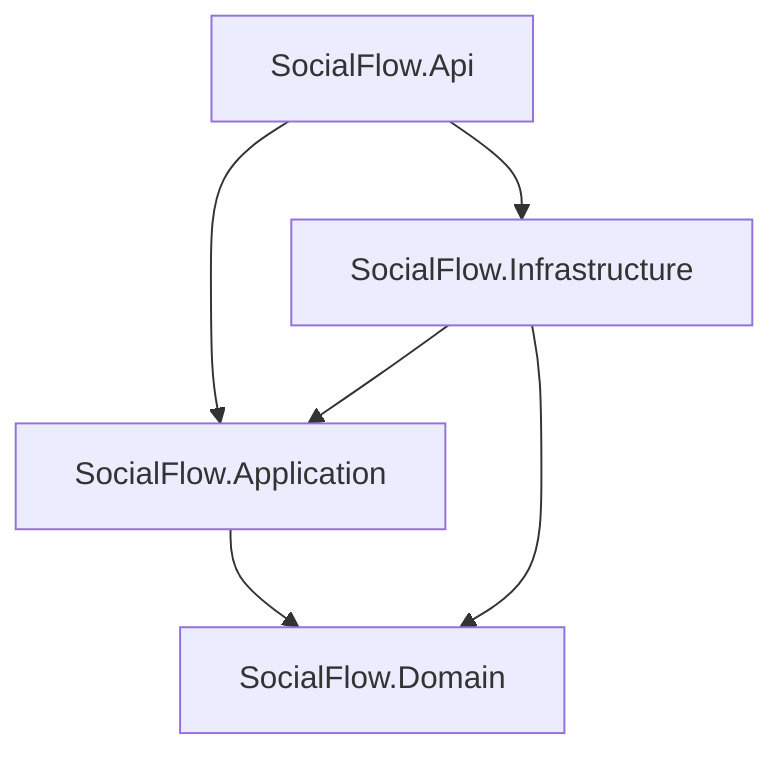

3.1 SocialFlow.Domain

Contains the business core.

Typical contents:

Entities

Value Objects

Domain Events

Domain Rules

Domain Exceptions

Rule: Domain must not depend on Application, Infrastructure, or API.

3.2 SocialFlow.Application

Contains application use cases and orchestration.

Typical contents:

Commands

Queries

Command Handlers

Query Handlers

DTOs

Validators

MediatR Pipeline Behaviors

Application abstractions/interfaces

Domain Event Handlers when they represent application workflows

Dependency: Application depends on Domain.

3.3 SocialFlow.Infrastructure

Contains implementations that interact with frameworks and external
systems.

Typical contents:

EF Core DbContext

PostgreSQL repositories

Redis cache implementation

Cloudinary implementation

Email implementation

Authentication implementation

Hangfire jobs

Outbox processor

SignalR infrastructure

EF Core migrations

Dependency: Infrastructure implements abstractions owned by the
inner layers.

3.4 SocialFlow.Api

Application entry point.

Typical contents:

Controllers

Middleware

Authentication/authorization pipeline

Rate limiting

OpenAPI

SignalR endpoint mapping

Dependency Injection composition root

### 4. Request Lifecycle

SocialFlow has two primary synchronous request paths:

Query:
Client → API → MediatR → Query Handler → Redis/PostgreSQL → DTO → Client

Command:
Client → API → MediatR → Command Handler → Domain → PostgreSQL + Outbox → Client

Asynchronous side effects continue separately:

Outbox → Hangfire → MediatR.Publish → Event Handler → SignalR / Email / Other Side Effects

### 5. Query Request Flow

Queries read state and should not modify domain state.

Example: GET /posts/feed

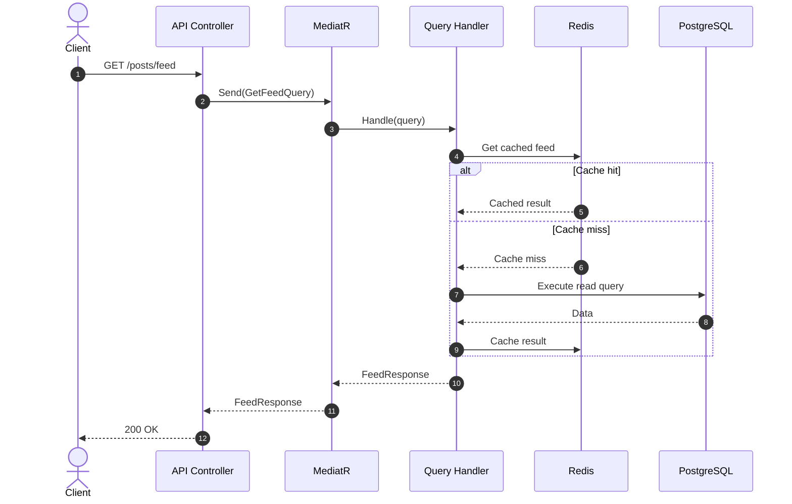

Query responsibilities

Validate query-specific input when necessary.

Read from cache when appropriate.

Query only the data needed by the response.

Prefer projection to DTOs for read-heavy endpoints.

Avoid domain mutations.

Return application DTOs rather than persistence entities.

### 6. Command Request Flow

Commands represent an intention to change system state.

Example: POST /friend-requests

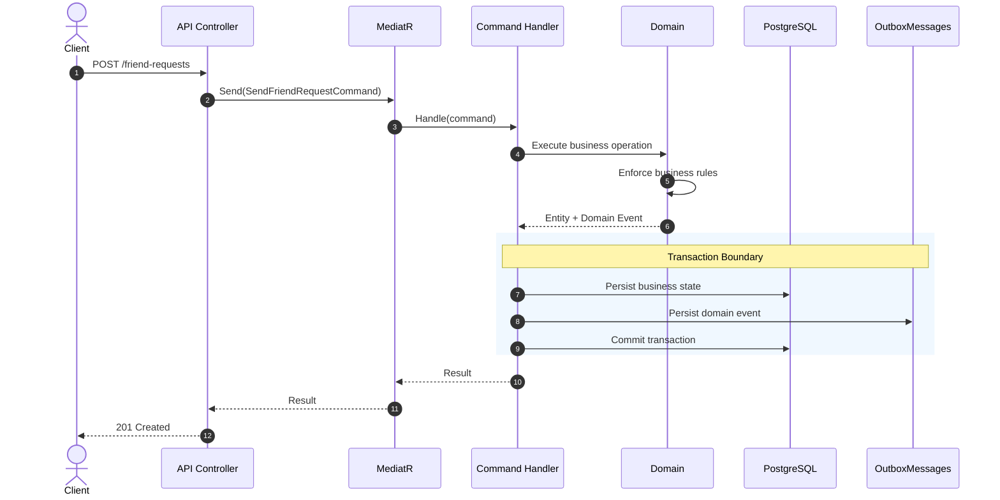

Command responsibilities

Load required domain state.

Invoke domain behavior.

Persist state changes.

Capture generated domain events.

Persist outbox messages in the same database transaction.

Return only after the synchronous transaction succeeds.

Command handlers should avoid

Sending emails directly.

Sending SignalR notifications directly.

Performing slow external side effects before the database commit.

Mixing unrelated business workflows into one handler.

### 7. CQRS & MediatR

CQRS separates write intentions from read requests.

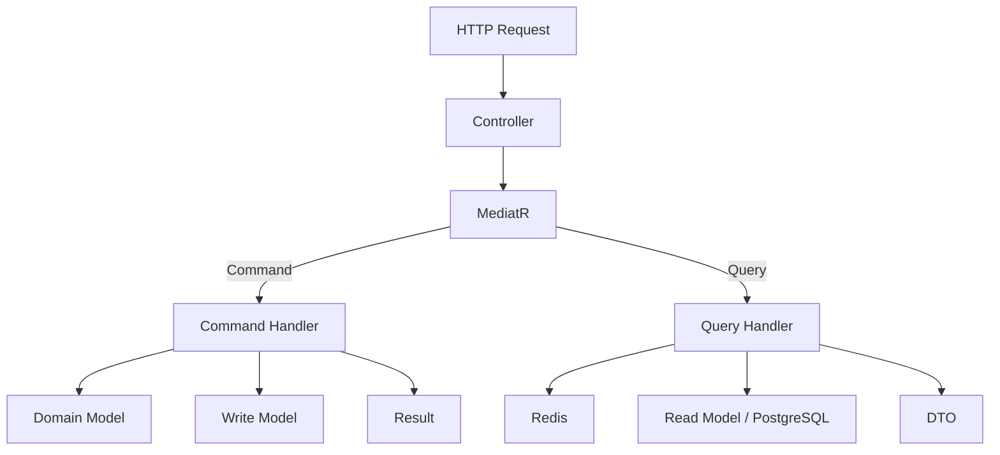

MediatR responsibilities

MediatR is the in-process dispatcher between the API and application
handlers.

var result = await sender.Send(command, cancellationToken);

For asynchronous domain-event processing:

await publisher.Publish(domainEvent, cancellationToken);

MediatR itself is not a durable message broker. Reliability for
events that must survive process crashes is provided by the Outbox
Pattern.

### 8. MediatR Pipeline

Cross-cutting application concerns can be implemented as MediatR
pipeline behaviors.

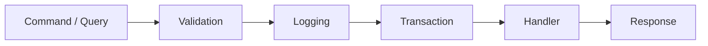

Implementation note: Only document TransactionBehavior as active
if the project actually implements transaction management in a
pipeline behavior. If transactions currently live inside handlers,
update this diagram accordingly.

Potential behaviors:

Validation

Logging

Performance measurement

Authorization where appropriate

Transaction management for commands

Idempotency where required

### 9. Transaction Boundary

The most important guarantee of the Outbox Pattern is that business
data and the event describing that change are committed atomically.

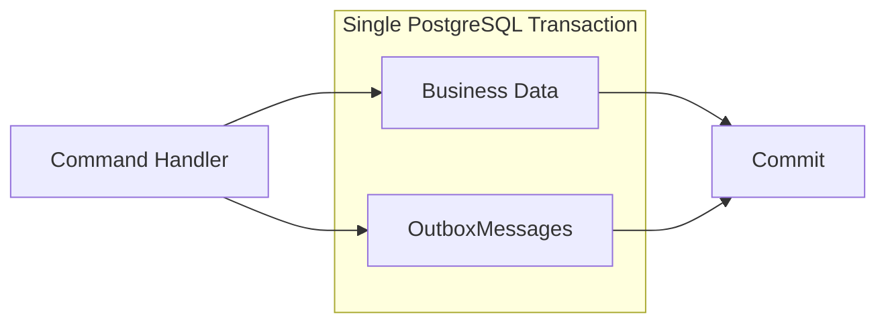

Example:

FriendRequests +
OutboxMessages
↓
Same PostgreSQL Transaction
↓
Commit

If the transaction fails, neither record is committed.

If it succeeds, the event remains available for later asynchronous
processing even if the application crashes immediately after the commit.

### 10. Transactional Outbox Pattern

Purpose

The Outbox Pattern prevents this failure scenario:

### 1. Save FriendRequest successfully
### 2. Application crashes
### 3. Notification was never sent

Instead:

### 1. Save FriendRequest
### 2. Save FriendRequestCreated event to OutboxMessages
### 3. Commit both atomically
### 4. Return HTTP response
### 5. Background processor reads the event
### 6. Execute side effects

Outbox processing sequence

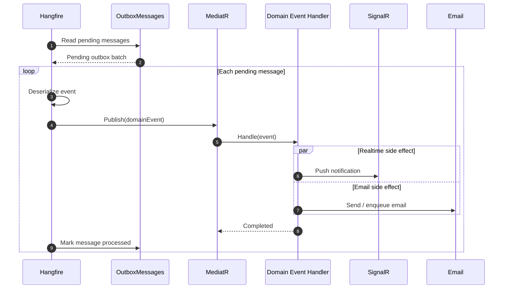

Delivery semantics

The custom processor targets at-least-once processing.

Therefore, event handlers that perform externally visible side effects
should be designed with idempotency in mind.

### 11. Outbox State & Failure Handling

A state diagram is useful because an outbox record has a lifecycle
rather than a request/response flow.

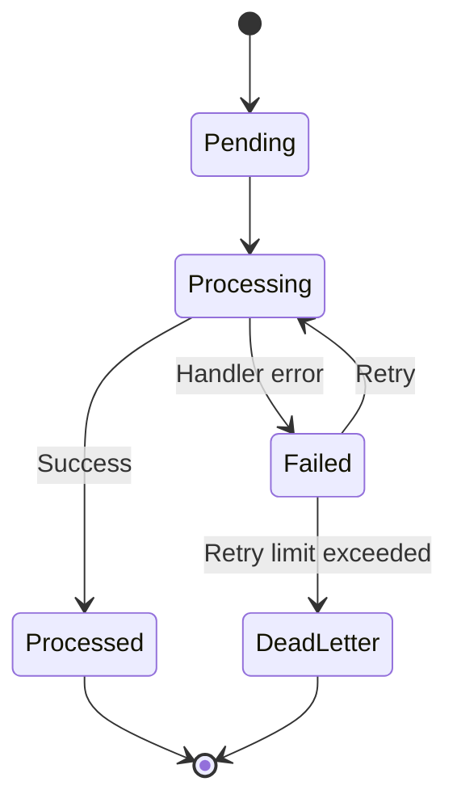

DeadLetter is a recommended state if repeated failures need manual
inspection. Remove it if the current implementation does not support
it.

Suggested fields:

| Field | Purpose |
|---|---|

| Id | Unique message identifier |
| Type | Event type |
| Content | Serialized event payload |
| OccurredOn | Event occurrence timestamp |
| ProcessedOn | Successful processing timestamp |
| Status | Processing state |
| RetryCount | Number of attempts |
| Error | Last processing error |

### 12. Domain Events

Domain events represent meaningful facts that occurred in the domain.

Examples:

FriendRequestCreated
FriendRequestAccepted
PostCreated
PostReacted
CommentCreated
AvatarUpdated
MessageSent

Typical lifecycle:

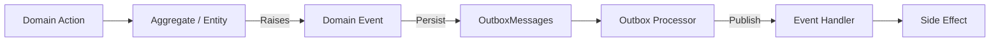

Domain events should describe what happened, not what another
component should do.

Prefer:

FriendRequestCreated

over:

SendFriendRequestNotification

### 13. Real-Time Architecture

SignalR is used for server-to-client real-time communication.

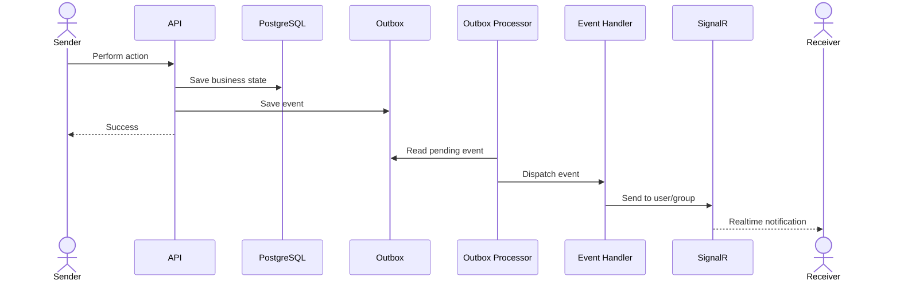

SignalR responsibilities

Notifications

Online presence

Typing indicators

Read receipts

Chat updates

Call signaling where applicable

SignalR should not be treated as durable event storage.

### 14. Caching Architecture

SocialFlow uses Redis primarily for frequently accessed or temporary
data.

Recommended strategy: Cache Aside.

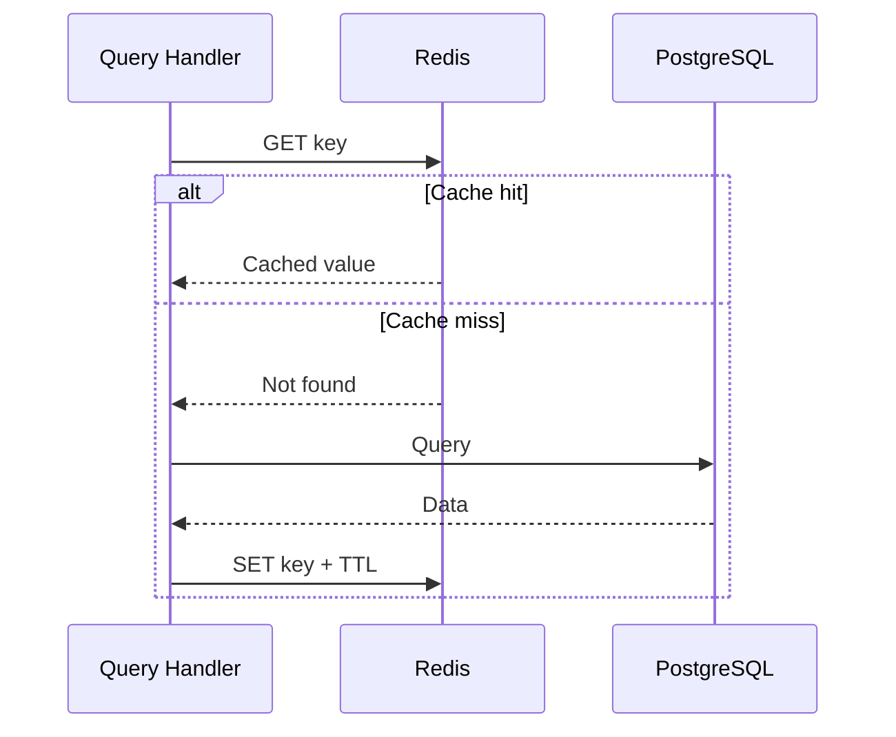

Potential Redis use cases:

Feed caching

User/profile caching

Online presence

Distributed coordination when needed

Rate-limit/distributed state when needed

Short-lived application state

Cache invalidation

Commands that modify cached resources should invalidate or update
affected cache entries.

Command
↓
PostgreSQL Commit
↓
Invalidate / Refresh relevant cache

For critical consistency, define explicitly whether invalidation is
synchronous or event-driven.

### 15. Authentication & Authorization

Authentication flow

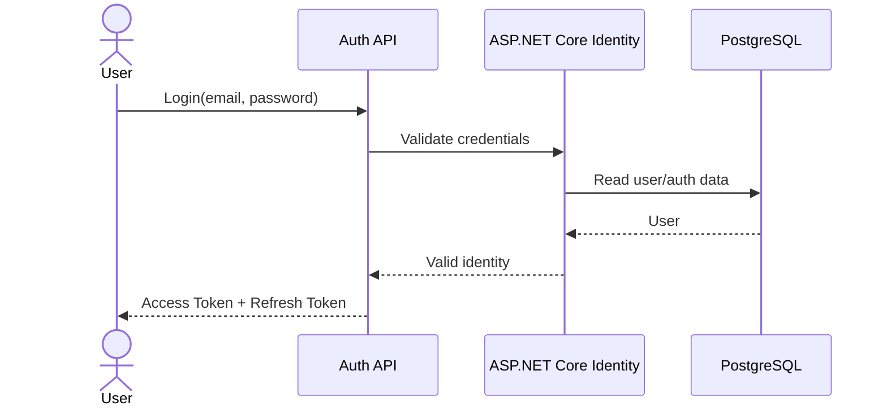

Request authorization

Client
↓ Authorization: Bearer <JWT>
Authentication Middleware
↓
Authorization Policy / [Authorize]
↓
Controller
↓
Application Use Case

Recommended token model:

Short-lived access token

Longer-lived refresh token

Refresh-token rotation/revocation if implemented

Secrets must be supplied through secure configuration and never
committed to source control.

### 16. Media Architecture

For large media files, clients upload directly to Cloudinary using a
backend-generated signed upload configuration.

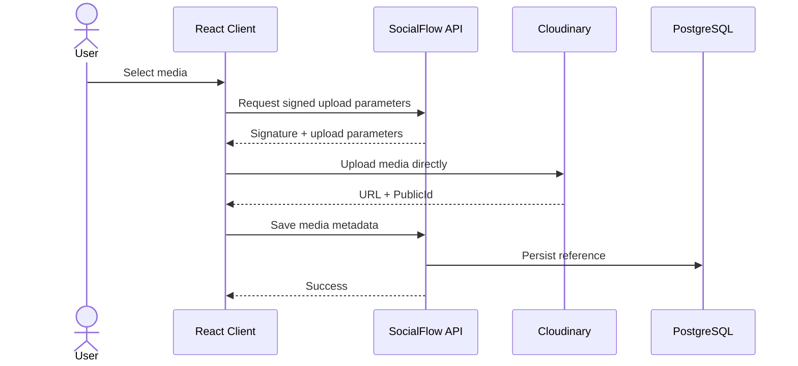

Important cleanup rule

Do not expose a Cloudinary deletion secret to the browser.

If an uploaded asset must be removed, the client should request deletion
through the backend, and the backend performs the authenticated
Cloudinary deletion.

### 17. Background Processing

Hangfire runs asynchronous and scheduled work.

Current / planned jobs

| Job | Purpose |
|---|---|

| ProcessOutboxMessagesJob | Process pending outbox events |
| Media | cleanup Remove orphaned assets |
| Story | expiration Expire temporary stories |
| Email jobs | Deliver asynchronous email |
| Maintenance jobs | Scheduled cleanup |

Background jobs should be:

Retry-safe.

Idempotent where possible.

Observable through structured logs.

Designed so one failed item does not permanently block the whole
batch.

### 18. Database & Persistence

Primary database

PostgreSQL is the source of truth for durable application state.

EF Core is used for:

Mapping

Queries

Change tracking

Transactions

Migrations

Naming conventions

| Item | Convention |
|---|---|

| Tables | PascalCase, plural |
| Columns | PascalCase |
| Primary key | Id |
| Foreign key | {EntityName}Id |
| Created timestamp | CreatedAt |
| Updated timestamp | UpdatedAt |

Special table: OutboxMessages

The outbox table belongs to the persistence infrastructure but
participates in the same transaction as business tables.

### 19. Middleware & Cross-Cutting Concerns

The exact middleware order should match the running application.

Conceptually:

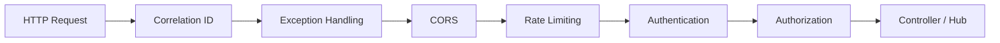

Cross-cutting concerns include:

Global exception handling

Correlation IDs

Structured logging

Authentication

Authorization

CORS

Rate limiting

Validation

Request tracing

### 20. Observability

Structured logging should make it possible to trace a request and its
later asynchronous work.

Recommended metadata:

CorrelationId
UserId
RequestPath
CommandName / QueryName
OutboxMessageId
DomainEventType
JobId
ElapsedTime

Example trace:

HTTP Request
CorrelationId = abc123
↓
SendFriendRequestCommand
↓
OutboxMessage = xyz789
↓
ProcessOutboxMessagesJob
↓
FriendRequestCreatedEventHandler

### 21. Deployment Architecture

Development infrastructure can be run with Docker Compose.

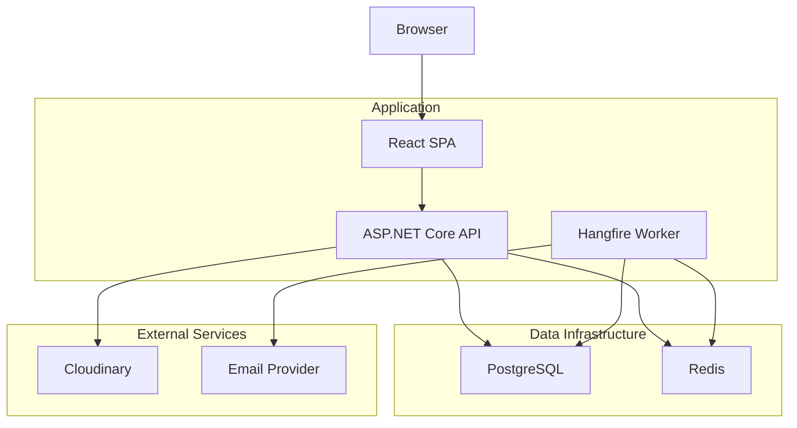

Local infrastructure

docker-compose -f docker-compose.infra.yml up -d

Typical local services:

PostgreSQL

Redis

### 22. Architecture Decision Summary

| Decision | Reason |
|---|---|

| Clean Architecture | Protect business logic from framework dependencies |
| CQRS | Separate read and write use cases |

| MediatR | Decouple API from application handlers |
| PostgreSQL | Durable relational source of truth |

| Redis | Fast temporary/cache data |

| Transactional Outbox | Reliable asynchronous side effects |

| Hangfire | Background and scheduled processing |

| SignalR | Real-time server-to-client communication |

### 23. End-to-End Example: Send Friend Request

This section ties the architecture together.

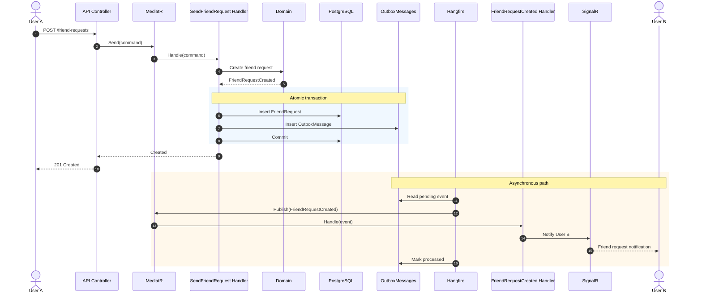

End-to-end mental model

SYNCHRONOUS
───────────

React Client
↓
Controller
↓
MediatR.Send
↓
Command Handler
↓
Domain
↓
PostgreSQL + Outbox
↓
Commit
↓
HTTP Response

ASYNCHRONOUS
────────────

OutboxMessages
↓
Hangfire
↓
MediatR.Publish
↓
Domain Event Handler
↓
SignalR / Email / Other Side Effects

### 24. Documentation Boundaries

Keep implementation/setup details outside this architecture document
where possible.

Recommended documentation structure:

docs/
├── architecture/
│ ├── architecture.md
│ ├── outbox-pattern.md
│ ├── realtime.md
│ └── caching.md
│
├── usecases/
│ ├── authentication.md
│ ├── posts.md
│ ├── friendship.md
│ └── messaging.md
│
└── development/
├── getting-started.md
├── migrations.md
├── docker.md
└── conventions.md

The architecture document should answer primarily:

What are the major components?

What depends on what?

How does a query travel through the system?

How does a command travel through the system?

Where is the transaction boundary?

How are domain events delivered reliably?

How do asynchronous side effects execute?

Where do Redis, SignalR, Cloudinary, and Hangfire fit?
