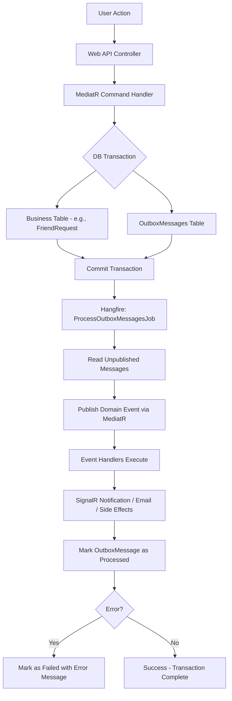
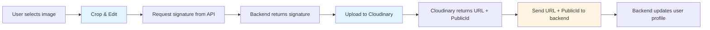

# SocialFlow Architecture Documentation

## 1. Tổng quan hệ thống (System Overview)

**Kiến trúc:** Clean Architecture (Onion Architecture)

**Pattern chính:** 
- CQRS (với MediatR)
- Event-Driven với custom Outbox Pattern (không sử dụng CAP)
- Repository Pattern

**Mục tiêu:** Tách biệt nghiệp vụ (Business Logic) khỏi hạ tầng (Infrastructure), đảm bảo tính nhất quán dữ liệu (Data Consistency), dễ test và mở rộng.

## 2. Sơ đồ khối (High-Level Diagram)

```
Client Layer
    ↓
API Layer (ASP.NET Core Web API)
    ↓
Application Layer (CQRS Handlers)
    ↓
    ├─→ Domain Layer (Business Logic)
    │        ↓
    │    Infrastructure Layer
    │        ├─→ PostgreSQL (Primary Database)
    │        ├─→ Redis (Caching)
    │        ├─→ Cloudinary (Media Storage)
    │        ├─→ SignalR (Real-time)
    │        └─→ Hangfire (Background Jobs)
    │
    └─→ Outbox Pattern (Custom Implementation)
             ↓
         Hangfire Jobs
             ↓
         Domain Events
             ↓
         SignalR / Email / Notifications
```

**Các thành phần chính:**

- **Client Layer:** React SPA (Vite + TypeScript)
- **API Layer:** ASP.NET Core Web API 10.0 (RESTful)
- **Persistence Layer:** PostgreSQL (Primary DB) + Redis (Caching)
- **Background Processing:** Hangfire (Jobs) + Custom Outbox Processor
- **Media Storage:** Cloudinary (signature-based upload)
- **Real-time:** SignalR

## 3. Cấu trúc Solution (Backend Structure)

Giải thích ý nghĩa của từng Project trong bộ code .NET:

### SocialFlow.Domain
- **Chứa:** Entities, Value Objects, Domain Events, Repository Interfaces
- **Đặc điểm:** Không phụ thuộc vào bất kỳ project nào khác (Dependency Rule)
- **Quan trọng:** Đây là core của hệ thống, chứa business logic chính

### SocialFlow.Application
- **Chứa:** Commands/Queries (CQRS), MediatR Handlers, DTOs, Validation, Mapping
- **Đặc điểm:** Depends only on Domain layer
- **Chức năng:** Orchestrates business workflows, handles application logic

### SocialFlow.Infrastructure
- **Chứa:** DBContext, EF Core Migrations, External Service Implementations, Background Jobs
- **Các phần chính:**
  - `Persistence/`: Database context và migrations (PostgreSQL)
  - `Services/`: Cloudinary, Email, Media services
  - `Authentication/`: JWT + ASP.NET Core Identity
  - `BackgroundJobs/`: Hangfire jobs (ProcessOutboxMessagesJob)
  - `Hubs/`: SignalR hubs
- **Đặc điểm:** Implements interfaces defined in Application/Domain layers

### SocialFlow.Api
- **Chứa:** Controllers, Middleware, Swagger/OpenAPI configuration
- **Đặc điểm:** Entry point của ứng dụng
- **Chức năng:**
  - Đón HTTP requests
  - Cấu hình Dependency Injection
  - Middleware pipeline (CORS, Rate Limiting, Exception Handling, Serilog)
  - Swagger documentation

## 4. Luồng xử lý dữ liệu (Data Flow & Outbox Pattern)

### Custom Outbox Pattern Implementation

Hệ thống sử dụng **custom Outbox Pattern** (không sử dụng CAP) để đảm bảo "At-least-once delivery" cho domain events.

#### Quy trình xử lý:

Khi một hành động làm thay đổi dữ liệu (ví dụ: Gửi Friend Request, Update Avatar):



#### Chi tiết implementation:

1. **Command Handler:**
   ```csharp
   // Trong handler, mở transaction
   using var transaction = await _context.Database.BeginTransactionAsync();
   
   // 1. Lưu entity
   _context.FriendRequests.Add(friendRequest);
   
   // 2. Lưu domain event vào outbox
   friendRequest.AddDomainEvent(new FriendRequestCreatedEvent(...));
   _context.OutboxMessages.Add(new OutboxMessage { ... });
   
   // 3. Commit transaction
   await _context.SaveChangesAsync();
   await transaction.CommitAsync();
   ```

2. **Outbox Processor (Hangfire Job):**
   - **File:** `Infrastructure/BackgroundJobs/ProcessOutboxMessagesJob.cs`
   - **Frequency:** Được schedule bởi Hangfire (thường mỗi 1-2 phút)
   - **Process:**
     - Query các `OutboxMessage` chưa được process
     - Deserialize thành `IDomainEvent`
     - Publish via MediatR
     - Update status thành "Processed" hoặc "Failed"

3. **Event Handlers:**
   - Đăng ký trong Application layer
   - Ví dụ: `FriendRequestCreatedEventHandler` → Gửi notification qua SignalR

## 5. Quy định về Database (Database Schema)

### Primary Database: PostgreSQL

**Migrations:** Sử dụng EF Core Migrations

**Cách chạy migrations:**
```bash
# Windows PowerShell
cd Backend/src
.\ef.ps1 -add MigrationName
.\ef.ps1 -up

# Cross-platform
dotnet ef migrations add MigrationName \
  --project src/Infrastructure/Infrastructure.csproj \
  --startup-project src/Api/Api.csproj \
  --output-dir Persistence/Migrations

dotnet ef database update \
  --project src/Infrastructure/Infrastructure.csproj \
  --startup-project src/Api/Api.csproj
```

**Naming Convention:**
- Tên bảng: PascalCase, số nhiều (Users, Posts, Friendships)
- Tên cột: PascalCase
- Primary Keys: `Id` (Guid)
- Foreign Keys: `{EntityName}Id` (e.g., `UserId`, `PostId`)
- Created/Updated timestamps: `CreatedAt`, `UpdatedAt`

### Special Tables:

**OutboxMessages:**
- Dùng để implement Outbox Pattern
- Columns: `Id`, `Content` (JSON), `OccurredOn`, `ProcessedOn`, `Status`, `Error`

## 6. Real-time & Notifications

### SignalR Implementation

**Hub:** `NotificationHub` (`Infrastructure/Hubs/NotificationHub.cs`)

**Endpoint:** `/hubs/notifications`

**Flow:**
1. Client kết nối đến SignalR hub
2. Khi Domain Event được process từ Outbox:
   - Event handler gửi message đến `NotificationHub`
   - Hub kiểm tra danh sách online users
   - Push notification xuống connected clients

**Example Usage:**
```typescript
// Frontend
const connection = new HubConnectionBuilder()
  .withUrl(`${API_URL}/hubs/notifications`)
  .withAutomaticReconnect()
  .build();

connection.on("ReceiveNotification", (notification) => {
  // Handle notification
});
```

## 7. Authentication & Authorization

### JWT + ASP.NET Core Identity

**Flow:**
1. User đăng ký/đăng nhập
2. Server phát JWT token (expiration: 15 phút)
3. Client gửi token qua `Authorization: Bearer {token}`
4. Server validate token qua `[Authorize]` attribute

**Token Settings** (`appsettings.json`):
```json
"JwtSettings": {
  "SecretKey": "your-secret-key-minimum-32-characters",
  "Issuer": "SocialFlow_API",
  "Audience": "SocialFlow_Frontend",
  "ExpiryInMinutes": 15
}
```

## 8. Media Upload (Cloudinary)

### Signature-Based Upload Pattern

**Tại sao không upload qua backend?**
- Giảm load cho server
- Client upload trực tiếp đến Cloudinary
- Backend chỉ cung cấp signature (security)

**Flow:**


**Endpoints:**

1. **Get Upload Signature:** `GET /media/setup-upload?folder=avatars`
   - Response: `{ signature, timestamp, apiKey, cloudName }`

2. **Upload to Cloudinary:** `POST https://api.cloudinary.com/v1_1/{cloudName}/image/upload`
   - Body: FormData với file, signature, timestamp, apiKey

3. **Update Avatar:** `POST /user/avatar`
   - Body: `{ avatarUrl, mediaType, publicId }`

**Cancel Behavior:**
- Nếu user cancel sau khi upload thành công, frontend gọi Cloudinary delete API để xóa ảnh

## 9. Infrastructure Services

### Docker Compose
File: `Backend/docker-compose.infra.yml`

Services:
- PostgreSQL (port 5432)
- Redis (port 6379)

Run:
```bash
docker-compose -f docker-compose.infra.yml up -d
```

### Background Jobs (Hangfire)

**Dashboard:** `/hangfire`

**Jobs:**
- `ProcessOutboxMessagesJob`: Xử lý outbox messages (scheduled)
- Custom jobs có thể được thêm vào

### Logging (Serilog)

**Configuration:** Structured logging với Serilog
- Console output
- Log levels: Information (Microsoft), Error (>= 500)
- Enrich with correlation ID

## 10. API Documentation

### Swagger/OpenAPI

**URL:** `http://localhost:5000/swagger`

**Features:**
- Interactive API testing
- Schema documentation
- Authentication support (JWT)

**OpenAPI Spec:** `http://localhost:5000/openapi/v1.json`

## 11. Middleware Pipeline

**Order:**
1. CORS Policy (`SocialFlowCorsPolicy`)
2. Correlation ID Middleware
3. Global Exception Middleware
4. HTTPS Redirection (production)
5. Rate Limiter (100 req/min)
6. Authorization
7. Controllers
8. SignalR Hubs

**Rate Limiting:**
- Policy: Fixed Window
- Limit: 100 requests per minute
- Queue Limit: 2 requests
