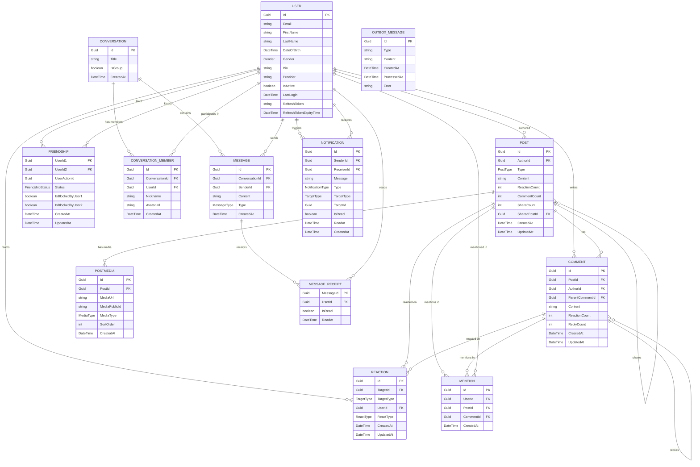

# SocialFlow — Entity Relationship Diagram

> Auto-generated from domain entities and EF Core configurations.

## ERD Diagram



## Enumerations

| Enum | Values | Used In |
|------|--------|---------|
| `PostType` | Standard | `Post.Type` |
| `TargetType` | Post, Comment | `Reaction.TargetType`, `Notification.TargetType` |
| `ReactType` | *(various reaction types)* | `Reaction.ReactType` |
| `FriendshipStatus` | None, Pending, Accepted, Blocked | `Friendship.Status` |
| `Gender` | *(gender options)* | `User.Gender` |
| `MediaType` | Image, Video | `CloudAsset.Type` (owned by `PostMedia`, `Comment`, `User`) |
| `MessageType` | Text | `Message.Type` |
| `NotificationType` | FriendRequestReceived, FriendRequestAccepted, … | `Notification.Type` |

## Value Objects

| Value Object | Properties | Owned By |
|-------------|-----------|----------|
| `CloudAsset` | `Url`, `PublicId`, `Type` (MediaType) | `User.Avatar`, `User.Cover`, `PostMedia.Media`, `Comment.Media` |
| `CommentPreview` | *(stored as JSON)* | `Post.TopComments` (owned collection) |

## Relationship Summary

```
┌──────────┐
│   User   │
└────┬─────┘
     │ 1
     │
     ├─── 1:N ──── Post ────────────────────────────────┐
     │                 │ 1                               │
     │                 ├── 1:N ── PostMedia              │
     │                 ├── 1:N ── Comment ───┐           │
     │                 │            │ 1       │           │
     │                 │            ├── 1:N ──┘ (replies) │
     │                 │            └── 1:N ── Mention    │
     │                 ├── 1:N ── Reaction                │
     │                 └── 1:N ── Post (shares) ◄─────────┘
     │
     ├─── 1:N ──── Reaction
     ├─── M:N ──── Friendship (composite PK: UserId1 + UserId2)
     ├─── 1:N ──── Mention (as mentioned user)
     │
     ├─── 1:N ──── ConversationMember ──── N:1 ──── Conversation
     │                                                  │
     ├─── 1:N ──── Message ────────────────────────────┘
     │                 │
     │                 └── 1:N ── MessageReceipt ── N:1 ── User
     │
     ├─── 1:N ──── Notification (as sender)
     └─── 1:N ──── Notification (as receiver)