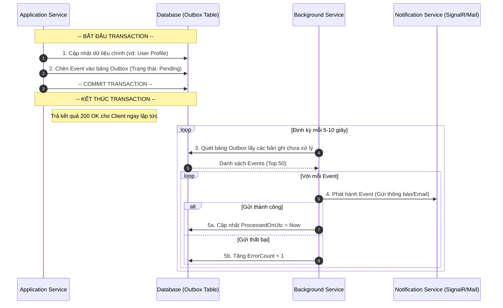

Documentation: Transactional Outbox Pattern
1. Giới thiệu (Overview)

Tổng quan về Outbox Pattern
Transactional Outbox Pattern là một mẫu thiết kế (design pattern) được sử dụng để giải quyết vấn đề "Ghi dữ liệu kép" (Dual Write) trong các hệ thống phần mềm. Mẫu này đảm bảo tính Nguyên tử (Atomicity) giữa việc cập nhật cơ sở dữ liệu chính và việc phát hành các sự kiện (Events) ra bên ngoài.

Trong các hệ thống phân tán hoặc ứng dụng hướng sự kiện (Event-driven), khi một hành động nghiệp vụ xảy ra (ví dụ: người dùng đổi Avatar), hệ thống thường phải thực hiện hai việc:

Cập nhật thông tin vào bảng Users.

Gửi thông báo đến các dịch vụ khác (SignalR, Email, hoặc Message Broker).

Nếu việc lưu vào DB thành công nhưng việc gửi thông báo thất bại (do mất mạng, sập server), dữ liệu sẽ bị mất tính nhất quán. Outbox Pattern lưu các thông báo này vào chính Database của ứng dụng trước khi gửi đi để đảm bảo không có sự kiện nào bị bỏ sót.

Mục tiêu cốt lõi
Đảm bảo gửi tin nhắn (Guaranteed Delivery): Đảm bảo mọi sự kiện được tạo ra đều sẽ được phát hành đến đích cuối cùng (at-least-once delivery).

Nhất quán dữ liệu (Data Consistency): Sự kiện chỉ được phát hành nếu và chỉ nếu giao dịch (transaction) của cơ sở dữ liệu chính đã được thực hiện thành công.

Khả năng phục hồi (Resilience): Cung cấp cơ chế tự động thử lại (retry) khi các dịch vụ ngoại vi gặp sự cố tạm thời.

Tại sao lại triển khai thủ công (Manual Implementation)?
Thay vì sử dụng các thư viện có sẵn (như CAP hay MassTransit), dự án này lựa chọn triển khai thủ công nhằm:

Kiểm soát hoàn toàn: Tự quản lý logic thử lại (retry policy) và tần suất quét dữ liệu (polling frequency) phù hợp với hạ tầng hiện có.

Tối ưu hóa tài nguyên: Giảm thiểu các phụ thuộc (dependencies) từ bên thứ ba cho các nhu cầu xử lý sự kiện đơn giản.

Dễ dàng bảo trì: Cấu trúc bảng và logic xử lý được thiết kế tinh gọn, bám sát vào Business Logic của dự án mà không cần cấu hình phức tạp.

2. Cấu trúc dữ liệu (Data Schema)
Liệt kê bảng Outbox để người khác biết cần tạo gì trong DB.

Table Name: OutboxMessages

Columns:

Id (Guid): Khóa chính.

Type (String): Tên loại Event (vd: FriendRequestCreated).

Content (NVARCHAR(MAX)): Dữ liệu JSON của Event.

OccurredOnUtc (DateTime): Thời điểm tạo.

ProcessedOnUtc (DateTime?): Đánh dấu thời điểm xử lý thành công.

3. Sơ đồ luồng (Workflow Diagram)

4. Chi tiết các bước xử lý (Detailed Steps)

Bước 1: Persisting (Lưu trữ)
Giải thích về tính nguyên tử (Atomicity).

Mọi thay đổi dữ liệu phải nằm trong một DB Transaction.

Event phải được Serialize sang JSON và chèn vào bảng OutboxMessages trước khi Commit.

Bước 2: Polling & Publishing (Quét và Phát hành)
Mô tả cách thức Worker hoạt động.

Worker: Một BackgroundService chạy định kỳ 

Selection: Lấy TOP(50) tin nhắn có ProcessedOnUtc IS NULL.

Execution: Duyệt từng tin nhắn, gọi các Service tương ứng (SignalR/Mail).

Completion: Nếu thành công, cập nhật ProcessedOnUtc. Nếu lỗi, tăng ErrorCount.

5. Xử lý lỗi & Phục hồi (Error Handling & Resilience)
Phần này thể hiện tư duy của một Senior.

Retry Policy: Thử lại tối đa 5 lần trước khi đánh dấu là "Failed".

Idempotency: Phía nhận (Subscriber) phải kiểm tra ID tin nhắn để tránh xử lý trùng nếu Worker gửi lại.

Cleanup: Các tin nhắn đã xử lý hơn 30 ngày sẽ được xóa tự động để tránh phình database.