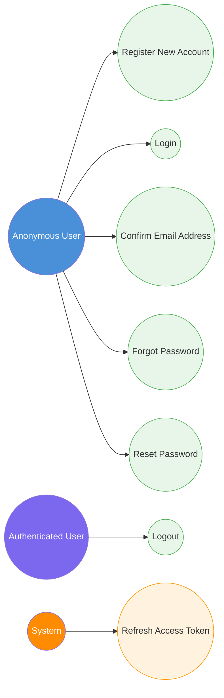

# 1. Authentication & Account Management

[← Back to Index](./README.md)

---

## UC-3.1 — Register New Account

| Field | Detail |
|-------|--------|
| **UC-ID** | UC-3.1 |
| **Title** | Register New Account |
| **Actor(s)** | Anonymous User |
| **Trigger** | User navigates to `/auth/register` and submits the registration form |

**Description:**
The anonymous user creates a new account by providing their personal details. Upon successful registration, a confirmation email is dispatched.

**Preconditions:**
- User is not authenticated
- User has a valid email address not already registered

**Main Success Flow:**
1. User navigates to the registration page (`/auth/register`)
2. User fills in: First Name, Last Name, Email, Date of Birth, Gender, Bio (optional)
3. User submits the registration form
4. System validates input (Zod on frontend, FluentValidation on backend)
5. System creates the user account (ASP.NET Identity)
6. System generates an email confirmation token
7. System enqueues a background email job (Hangfire → SMTP)
8. System returns `RegisterResponse` with the new user ID
9. User is redirected to the login page (or confirmation prompt)

**Alternative Flows:**
- **3a. Email already registered:** System returns a validation error indicating the email is already in use
- **4a. Validation failure:** System returns field-level validation errors (e.g., invalid email format, required fields missing, age restrictions)
- **7a. Email delivery failure:** System logs the error; user can request a new confirmation email later

**Postconditions:**
- A new user account exists in the database (email not yet confirmed)
- A confirmation email has been dispatched to the user's email address

**Business Rules:**
- Email must be unique across all users
- Password must meet ASP.NET Identity strength requirements
- Date of birth is required

---

## UC-3.2 — Login

| Field | Detail |
|-------|--------|
| **UC-ID** | UC-3.2 |
| **Title** | Login |
| **Actor(s)** | Anonymous User |
| **Trigger** | User navigates to `/auth/login` and submits the login form |

**Description:**
The anonymous user authenticates with email and password to gain access to the platform.

**Preconditions:**
- User has a registered account
- User is not currently authenticated

**Main Success Flow:**
1. User navigates to the login page (`/auth/login`)
2. User enters Email and Password
3. User submits the login form
4. System validates credentials via `IIdentityService`
5. System generates a JWT access token (15-minute expiry) and a refresh token (7-day expiry)
6. System persists the refresh token in the database
7. System sets HTTP-only cookies: `accessToken` and `refreshToken`
8. System returns user data (`LoginResponse`) in the response body (without tokens)
9. Frontend stores user data in Zustand auth store
10. User is redirected to the feed page (`/`)

**Alternative Flows:**
- **4a. Invalid credentials:** System returns an authentication error; user sees error message on the form
- **4b. Email not confirmed:** System returns an error indicating email confirmation is required
- **4c. Account locked out:** System returns a lockout error after too many failed attempts

**Postconditions:**
- User is authenticated
- Access token and refresh token cookies are set
- User state is stored in the frontend auth store

**Business Rules:**
- Access token expires in 15 minutes
- Refresh token expires in 7 days
- Tokens are stored in HTTP-only cookies for security (XSS protection)
- Password verification uses ASP.NET Identity password hasher

---

## UC-3.3 — Logout

| Field | Detail |
|-------|--------|
| **UC-ID** | UC-3.3 |
| **Title** | Logout |
| **Actor(s)** | Authenticated User |
| **Trigger** | User clicks the logout button |

**Description:**
The authenticated user ends their session, invalidating tokens and clearing client-side state.

**Preconditions:**
- User is currently authenticated

**Main Success Flow:**
1. User clicks the logout button
2. Frontend calls the logout endpoint
3. System clears the `accessToken` and `refreshToken` cookies
4. System invalidates the refresh token in the database
5. Frontend clears the Zustand auth store
6. User is redirected to the login page (`/auth/login`)

**Postconditions:**
- User session is terminated
- Cookies are cleared
- Auth store is reset

---

## UC-3.4 — Confirm Email Address

| Field | Detail |
|-------|--------|
| **UC-ID** | UC-3.4 |
| **Title** | Confirm Email Address |
| **Actor(s)** | Anonymous User |
| **Trigger** | User clicks the confirmation link in the registration email |

**Description:**
The user verifies ownership of their email address by clicking the confirmation link sent during registration.

**Preconditions:**
- User has a registered (unconfirmed) account
- User has received the confirmation email

**Main Success Flow:**
1. User clicks the confirmation link in the email (navigates to `/auth/confirm-email?userId=...&token=...`)
2. Frontend extracts `userId` and `token` from the URL query parameters
3. Frontend sends the confirmation request to the API
4. System URI-decodes the token
5. System validates the token via ASP.NET Identity `UserManager`
6. System marks the user's email as confirmed (`EmailConfirmed = true`)
7. Frontend displays a success message
8. User is redirected to the login page

**Alternative Flows:**
- **5a. Invalid or expired token:** System returns an error; user can request a new confirmation email
- **5b. Already confirmed:** System returns a message indicating email is already confirmed

**Postconditions:**
- User's `EmailConfirmed` field is set to `true`
- User can now log in without restriction

**Business Rules:**
- Token must be URI-decoded before validation
- Token has an expiration period (configured in ASP.NET Identity)

---

## UC-3.5 — Refresh Access Token

| Field | Detail |
|-------|--------|
| **UC-ID** | UC-3.5 |
| **Title** | Refresh Access Token |
| **Actor(s)** | System (automatic), Authenticated User |
| **Trigger** | Access token expires (15 minutes) or frontend detects 401 response |

**Description:**
When the JWT access token expires, the system uses the refresh token to obtain a new access token without requiring the user to re-authenticate.

**Preconditions:**
- User has a valid (non-expired) refresh token in cookies
- User was previously authenticated

**Main Success Flow:**
1. Frontend detects a 401 Unauthorized response from an API call (via Axios interceptor)
2. Frontend sends a POST request to `api/auth/refresh-token` with the refresh token cookie
3. System validates the refresh token against the database
4. System generates a new JWT access token (15-minute expiry)
5. System generates a new refresh token (7-day expiry), invalidating the old one
6. System updates cookies with new tokens
7. Frontend retries the original failed request with the new access token

**Alternative Flows:**
- **3a. Invalid or expired refresh token:** System returns 401; frontend clears auth state and redirects to login
- **3b. Refresh token revoked:** Same as 3a

**Postconditions:**
- New access token and refresh token cookies are set
- User remains authenticated seamlessly

**Business Rules:**
- Refresh tokens are single-use (rotated on each refresh)
- Old refresh token is invalidated when a new one is issued
- Refresh token lifetime is 7 days

---

## UC-3.6 — Forgot Password

| Field | Detail |
|-------|--------|
| **UC-ID** | UC-3.6 |
| **Title** | Forgot Password |
| **Actor(s)** | Anonymous User |
| **Trigger** | User navigates to `/auth/forgot-password` and submits their email |

**Description:**
A user who has forgotten their password requests a password reset link via email.

**Preconditions:**
- User has a registered account with a confirmed email

**Main Success Flow:**
1. User navigates to the forgot password page (`/auth/forgot-password`)
2. User enters their email address
3. User submits the form
4. System looks up the user by email
5. System generates a password reset token
6. System sends a password reset email containing a link with the token
7. System returns a success response (regardless of whether the email exists, for security)
8. Frontend displays a confirmation message

**Alternative Flows:**
- **4a. Email not found:** System returns success anyway (prevents email enumeration)

**Postconditions:**
- A password reset email is sent to the user's email address (if account exists)

**Business Rules:**
- Always return success to prevent email enumeration attacks
- Reset token has an expiration period
- Rate limiting applies to prevent abuse

---

## UC-3.7 — Reset Password

| Field | Detail |
|-------|--------|
| **UC-ID** | UC-3.7 |
| **Title** | Reset Password |
| **Actor(s)** | Anonymous User |
| **Trigger** | User clicks the reset link in the forgot-password email |

**Description:**
The user sets a new password using the token received in the forgot-password email.

**Preconditions:**
- User has a valid (non-expired) password reset token
- User has received the reset email

**Main Success Flow:**
1. User clicks the reset link (navigates to `/auth/reset-password?userId=...&token=...`)
2. Frontend extracts `userId` and `token` from URL query parameters
3. User enters a new password and confirms it
4. Frontend sends the reset request with `userId`, `token`, and new password
5. System validates the reset token
6. System updates the user's password hash
7. Frontend displays a success message
8. User is redirected to the login page

**Alternative Flows:**
- **5a. Invalid or expired token:** System returns an error; user must request a new reset link
- **5b. Password too weak:** System returns validation error

**Postconditions:**
- User's password is updated
- User can log in with the new password

**Business Rules:**
- Token must be URI-decoded before validation
- New password must meet ASP.NET Identity strength requirements