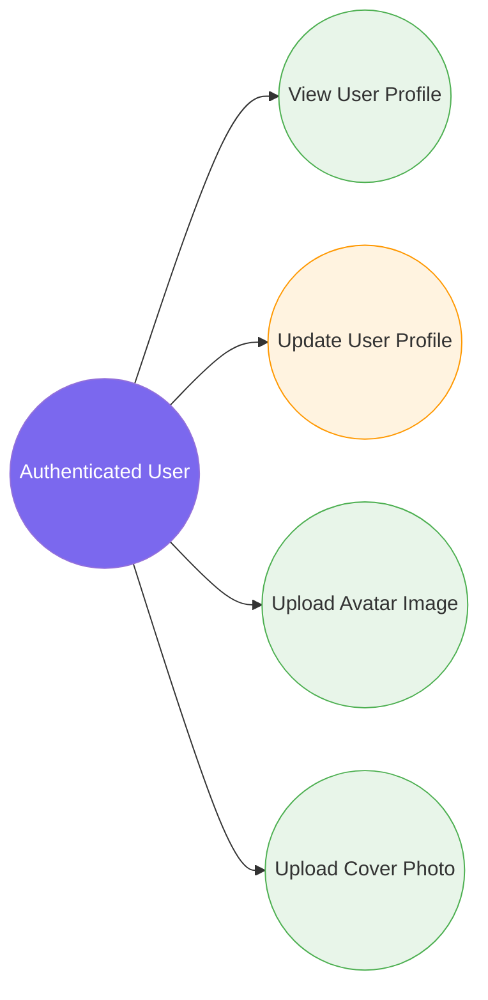

# 2. User Profile Management

[← Back to Index](./README.md)

---

## UC-4.1 — View User Profile

| Field | Detail |
|-------|--------|
| **UC-ID** | UC-4.1 |
| **Title** | View User Profile |
| **Actor(s)** | Authenticated User |
| **Trigger** | User navigates to `/profile/:id` |

**Description:**
The authenticated user views another user's (or their own) profile, displaying personal information, cover photo, avatar, bio, and post summary.

**Preconditions:**
- User is authenticated
- The target user exists

**Main Success Flow:**
1. User navigates to a profile page (`/profile/:id`)
2. Frontend sends a GET request to `api/user/{id}`
3. System retrieves the user's profile data (FirstName, LastName, Bio, AvatarUrl, CoverUrl, DateOfBirth, Gender, etc.)
4. System returns `UserResponse` with profile data
5. Frontend renders the profile page with the user's information

**Alternative Flows:**
- **3a. User not found:** System returns 404; frontend shows "User not found" message

**Postconditions:**
- User profile data is displayed

**Business Rules:**
- Any authenticated user can view any other user's profile
- Profile includes: name, avatar, cover photo, bio, and friendship status (if viewing another user)

---

## UC-4.2 — Update User Profile

| Field | Detail |
|-------|--------|
| **UC-ID** | UC-4.2 |
| **Title** | Update User Profile |
| **Actor(s)** | Authenticated User |
| **Trigger** | User edits their profile information and saves changes |

**Description:**
The authenticated user updates their profile details (name, bio, date of birth, gender).

**Preconditions:**
- User is authenticated
- User is editing their own profile

**Main Success Flow:**
1. User navigates to their profile page and clicks "Edit Profile"
2. User modifies desired fields (FirstName, LastName, Bio, DateOfBirth, Gender)
3. User submits the changes
4. System validates the input
5. System updates the user entity in the database
6. System returns the updated profile data
7. Frontend updates the displayed profile

**Alternative Flows:**
- **4a. Validation failure:** System returns field-level errors
- **4b. Unauthorized:** User attempts to edit another user's profile; system returns 403

**Postconditions:**
- User profile is updated in the database
- Updated information is reflected in the UI

**Business Rules:**
- Users can only edit their own profile
- FirstName and LastName are required
- Bio has a maximum length constraint

---

## UC-4.3 — Upload Avatar Image

| Field | Detail |
|-------|--------|
| **UC-ID** | UC-4.3 |
| **Title** | Upload Avatar Image |
| **Actor(s)** | Authenticated User |
| **Trigger** | User clicks "Change Avatar" on their profile |

**Description:**
The authenticated user uploads or updates their profile avatar image.

**Preconditions:**
- User is authenticated
- User has an image file to upload

**Main Success Flow:**
1. User clicks "Change Avatar" on their profile page
2. User selects an image file from their device
3. System validates the file (type: image, size limits)
4. System uploads the image to Cloudinary via the media service
5. System returns the `CloudAsset` (Url, PublicId)
6. System updates the user's `AvatarUrl` with the new image URL
7. If an old avatar existed, system schedules deletion of the old Cloudinary asset
8. Frontend displays the new avatar immediately

**Alternative Flows:**
- **3a. Invalid file type:** System returns a validation error
- **3b. File too large:** System returns a size limit error
- **4a. Upload failure:** System returns a server error; avatar remains unchanged

**Postconditions:**
- User's avatar is updated in the database and on Cloudinary
- Old avatar is cleaned up (if applicable)

**Business Rules:**
- Supported formats: JPEG, PNG, WebP, GIF
- Maximum file size applies (image limit)
- Old avatar is deleted from Cloudinary after successful replacement

---

## UC-4.4 — Upload Cover Photo

| Field | Detail |
|-------|--------|
| **UC-ID** | UC-4.4 |
| **Title** | Upload Cover Photo |
| **Actor(s)** | Authenticated User |
| **Trigger** | User clicks "Change Cover" on their profile |

**Description:**
The authenticated user uploads or updates their profile cover/banner photo.

**Preconditions:**
- User is authenticated
- User has an image file to upload

**Main Success Flow:**
1. User clicks "Change Cover" on their profile page
2. User selects an image file from their device
3. System validates the file (type: image, size limits)
4. System uploads the image to Cloudinary
5. System updates the user's `CoverUrl` with the new image URL
6. If an old cover existed, system schedules deletion of the old Cloudinary asset
7. Frontend displays the new cover photo immediately

**Alternative Flows:**
- **3a. Invalid file type/size:** System returns validation errors
- **4a. Upload failure:** Cover remains unchanged

**Postconditions:**
- User's cover photo is updated in the database and on Cloudinary
- Old cover is cleaned up (if applicable)

**Business Rules:**
- Same file constraints as avatar upload
- Recommended aspect ratio for cover photos (banner format)