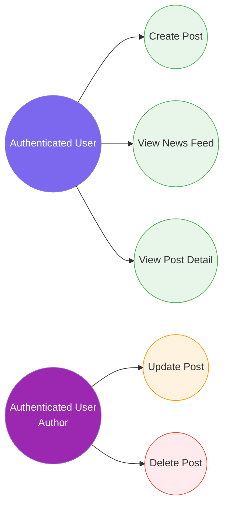

# 3. Post Management (News Feed)

[← Back to Index](./README.md)

---

## UC-5.1 — Create Post

| Field | Detail |
|-------|--------|
| **UC-ID** | UC-5.1 |
| **Title** | Create Post |
| **Actor(s)** | Authenticated User |
| **Trigger** | User writes content in the post composer and clicks "Post" |

**Description:** The authenticated user creates a new post with optional media attachments (images, videos).

**Preconditions:** User is authenticated; post content or at least one media file is provided.

**Main Success Flow:**
1. User navigates to the feed page or their profile
2. User enters text content in the post composer
3. User optionally attaches one or more media files (images, videos)
4. User clicks "Post"
5. If media is attached, frontend uploads files to Cloudinary and retrieves URLs
6. Frontend sends a POST request to `api/post` with content, media URLs, and post type
7. System validates the post data (FluentValidation)
8. System creates the `Post` entity with associated `PostMedia` records
9. System raises a `PostCreatedDomainEvent`
10. System returns the created post data
11. Frontend invalidates feed cache and displays the new post

**Alternative Flows:**
- **5a. Media upload failure:** System displays error; post is not submitted
- **7a. Validation failure:** System returns errors (e.g., content too long, missing content)
- **4a. Draft auto-save:** User may save the post as a draft before publishing (via `useDraftPost` hook)

**Postconditions:** A new `Post` entity exists with `PostMedia` records; domain event dispatched; post appears in feed.

**Business Rules:**
- Post `Content` has a maximum length constraint
- Media items are typed as `MediaType` enum (Image, Video, Audio, Gif, Document)
- `PostType` enum distinguishes post categories
- Posts are publicly visible to all authenticated users

---

## UC-5.2 — View News Feed

| Field | Detail |
|-------|--------|
| **UC-ID** | UC-5.2 |
| **Title** | View News Feed |
| **Actor(s)** | Authenticated User |
| **Trigger** | User navigates to `/` (home/feed page) |

**Description:** The authenticated user browses a paginated feed of posts from all users, sorted by recency.

**Preconditions:** User is authenticated.

**Main Success Flow:**
1. User navigates to the feed page (`/`)
2. Frontend sends a GET request to `api/post` with pagination parameters
3. System queries posts ordered by creation date (descending)
4. System returns a `PagedList<PostPreviewResponse>` containing post summaries
5. Each post includes: author info, content snippet, media thumbnails, reaction count, comment count, top comments
6. Frontend renders the feed with post cards
7. User can scroll to load more posts (pagination)

**Alternative Flows:**
- **4a. No posts exist:** Frontend displays an empty feed message

**Postconditions:** Feed is displayed with the latest posts.

**Business Rules:**
- Feed is paginated (configurable page size)
- Posts include aggregated data: reaction count, comment count, top comment previews
- Results are cached for performance (Redis)

---

## UC-5.3 — View Post Detail

| Field | Detail |
|-------|--------|
| **UC-ID** | UC-5.3 |
| **Title** | View Post Detail |
| **Actor(s)** | Authenticated User |
| **Trigger** | User clicks on a post card in the feed |

**Description:** The authenticated user views the full details of a specific post, including all media, comments, and reactions.

**Preconditions:** User is authenticated; the target post exists.

**Main Success Flow:**
1. User clicks on a post card or navigates to `/post/:postId`
2. Frontend sends a GET request to `api/post/{postId}`
3. System retrieves the post with all related data (author, media, reactions, comments)
4. System returns `PostDetailResponse` with full post data
5. Frontend renders: full content, all media, reaction summary, comment list, author info

**Alternative Flows:**
- **3a. Post not found:** System returns 404; frontend shows "Post not found"

**Postconditions:** Full post detail is displayed.

**Business Rules:**
- Post detail includes all associated media in full resolution
- Reactions are aggregated by type

---

## UC-5.4 — Update Post

| Field | Detail |
|-------|--------|
| **UC-ID** | UC-5.4 |
| **Title** | Update Post |
| **Actor(s)** | Authenticated User (post author) |
| **Trigger** | User clicks "Edit" on their own post |

**Description:** The post author updates the content of their existing post.

**Preconditions:** User is authenticated and is the author of the post; the post exists.

**Main Success Flow:**
1. User clicks "Edit" on their post
2. Frontend opens edit mode with current content
3. User modifies the content and saves
4. Frontend sends a PUT request to `api/post/{id}` with updated content
5. System validates user is the post author
6. System updates the post content and `UpdatedAt` timestamp
7. System returns the updated post data
8. Frontend refreshes the post display

**Alternative Flows:**
- **5a. Not the author:** System returns 403 Forbidden
- **5b. Post not found:** System returns 404

**Postconditions:** Post content and `UpdatedAt` timestamp are refreshed.

**Business Rules:** Only the post author can edit their posts; updated content must pass validation.

---

## UC-5.5 — Delete Post

| Field | Detail |
|-------|--------|
| **UC-ID** | UC-5.5 |
| **Title** | Delete Post |
| **Actor(s)** | Authenticated User (post author) |
| **Trigger** | User clicks "Delete" on their own post |

**Description:** The post author permanently deletes their post and all associated data.

**Preconditions:** User is authenticated and is the author of the post; the post exists.

**Main Success Flow:**
1. User clicks "Delete" on their post
2. Frontend shows a confirmation dialog
3. User confirms deletion
4. Frontend sends a DELETE request to `api/post/{id}`
5. System validates user is the post author
6. System cascade-deletes: Post → PostMedia, Comments, Reactions, Cloudinary media
7. System returns success
8. Frontend removes the post from the feed

**Alternative Flows:**
- **2a. User cancels:** No action
- **5a. Not the author:** System returns 403
- **5b. Post not found:** System returns 404

**Postconditions:** Post and all associated data permanently removed; Cloudinary assets deleted.

**Business Rules:**
- Only the post author can delete their posts
- Deletion is permanent (no soft delete)
- All child entities are cascade-deleted