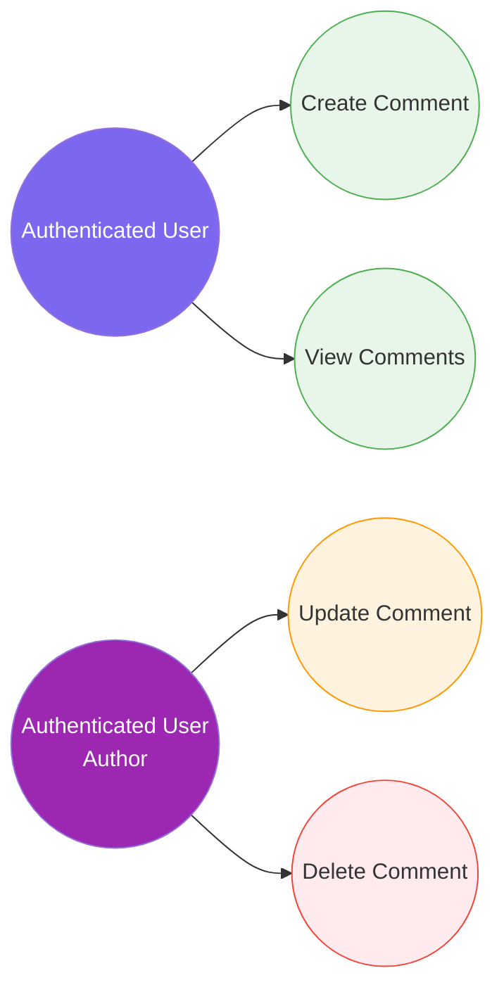

# 4. Comment Management

[← Back to Index](./README.md)

---

## UC-6.1 — Create Comment

| Field | Detail |
|-------|--------|
| **UC-ID** | UC-6.1 |
| **Title** | Create Comment |
| **Actor(s)** | Authenticated User |
| **Trigger** | User types a comment on a post and submits it |

**Description:** The authenticated user adds a comment to a specific post.

**Preconditions:** User is authenticated; the target post exists.

**Main Success Flow:**
1. User navigates to a post detail or sees a post in the feed
2. User types a comment in the comment input field
3. User submits the comment
4. Frontend sends a POST request to `api/comment` with `PostId` and `Content`
5. System validates the comment data
6. System creates the `Comment` entity linked to the post and user
7. System raises a `CommentCreatedDomainEvent`
8. System processes the event: dispatches SignalR notification to post author, persists `OutboxMessage`
9. System returns the created comment data
10. Frontend appends the new comment to the comment list

**Alternative Flows:**
- **5a. Validation failure:** System returns errors (empty content, content too long)
- **4a. Post not found:** System returns 404

**Postconditions:** New `Comment` entity linked to the post; comment count incremented; post author notified via SignalR; outbox message queued.

**Business Rules:**
- Comment `Content` is required and has a maximum length
- Comments are ordered by creation date (ascending)
- Domain events trigger notification dispatch

---

## UC-6.2 — View Comments for a Post

| Field | Detail |
|-------|--------|
| **UC-ID** | UC-6.2 |
| **Title** | View Comments for a Post |
| **Actor(s)** | Authenticated User |
| **Trigger** | User views a post detail or expands the comment section |

**Description:** The authenticated user views the paginated list of comments on a specific post.

**Preconditions:** User is authenticated; the target post exists.

**Main Success Flow:**
1. User views a post detail page or clicks "Comments" on a feed post
2. Frontend sends a GET request to `api/comment/{postId}` with pagination parameters
3. System queries comments for the post, ordered by creation date
4. System returns a paginated list of `CommentResponse` objects
5. Each comment includes: author info (name, avatar), content, reaction count, creation date
6. Frontend renders the comment list

**Alternative Flows:**
- **4a. No comments:** Frontend displays "No comments yet" message
- **3a. Post not found:** System returns 404

**Postconditions:** Comments are displayed under the post.

**Business Rules:**
- Comments are paginated
- Each comment includes the author's display name and avatar
- Feed posts show only top comment previews (`CommentPreview`)

---

## UC-6.3 — Update Comment

| Field | Detail |
|-------|--------|
| **UC-ID** | UC-6.3 |
| **Title** | Update Comment |
| **Actor(s)** | Authenticated User (comment author) |
| **Trigger** | User clicks "Edit" on their own comment |

**Description:** The comment author edits the content of their existing comment.

**Preconditions:** User is authenticated and is the author of the comment; the comment exists.

**Main Success Flow:**
1. User clicks "Edit" on their comment
2. Frontend opens inline editing mode
3. User modifies the comment content and saves
4. Frontend sends a PUT request to `api/comment/{id}` with updated content
5. System validates user is the comment author
6. System updates the comment content and `UpdatedAt` timestamp
7. System returns the updated comment
8. Frontend refreshes the comment display

**Alternative Flows:**
- **5a. Not the author:** System returns 403 Forbidden
- **5b. Comment not found:** System returns 404

**Postconditions:** Comment content and `UpdatedAt` timestamp are refreshed.

**Business Rules:** Only the comment author can edit; updated content must be non-empty and within max length.

---

## UC-6.4 — Delete Comment

| Field | Detail |
|-------|--------|
| **UC-ID** | UC-6.4 |
| **Title** | Delete Comment |
| **Actor(s)** | Authenticated User (comment author) |
| **Trigger** | User clicks "Delete" on their own comment |

**Description:** The comment author permanently deletes their comment from a post.

**Preconditions:** User is authenticated and is the author of the comment; the comment exists.

**Main Success Flow:**
1. User clicks "Delete" on their comment
2. Frontend shows a confirmation dialog
3. User confirms deletion
4. Frontend sends a DELETE request to `api/comment/{id}`
5. System validates user is the comment author
6. System deletes the comment and cascade-deletes associated reactions
7. System returns success
8. Frontend removes the comment from the list
9. Post's comment count is decremented

**Alternative Flows:**
- **2a. User cancels:** No action
- **5a. Not the author:** System returns 403
- **5b. Comment not found:** System returns 404

**Postconditions:** Comment and associated reactions permanently removed; post comment count updated.

**Business Rules:** Only the comment author can delete; deletion is permanent; associated reactions cascade-deleted.