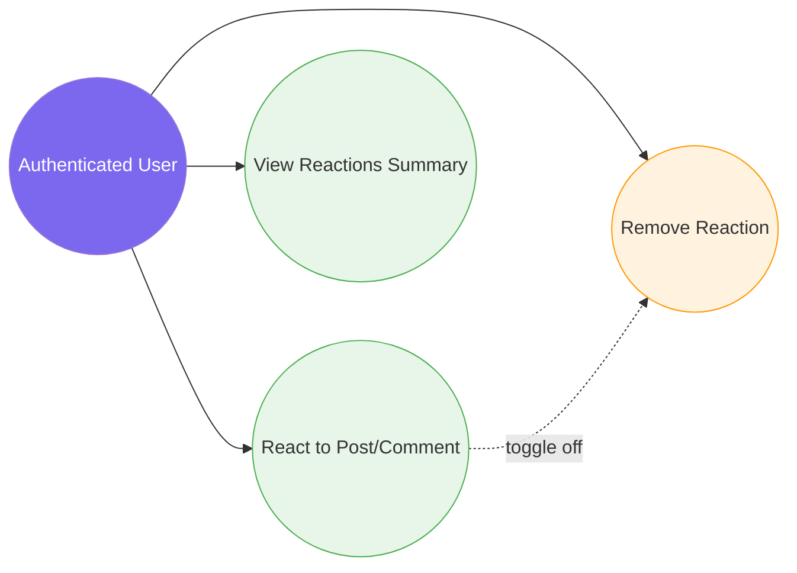

# 5. Reaction System

[← Back to Index](./README.md)

---

## UC-7.1 — React to Post or Comment

| Field | Detail |
|-------|--------|
| **UC-ID** | UC-7.1 |
| **Title** | React to Post or Comment |
| **Actor(s)** | Authenticated User |
| **Trigger** | User clicks a reaction button (e.g., Like, Love, Haha) on a post or comment |

**Description:** The authenticated user adds a reaction to a post or comment. If a reaction already exists from the same user on the same target, it is updated or toggled off.

**Preconditions:** User is authenticated; the target (post or comment) exists.

**Main Success Flow:**
1. User views a post or comment
2. User clicks a reaction button (Like, Love, Wow, Haha, Sad, Angry)
3. Frontend sends a POST request to `api/react` with `TargetId`, `TargetType` (Post/Comment), and `ReactType`
4. System checks if the user already has a reaction on this target
5. If no existing reaction: system creates a new `Reaction` entity
6. If existing reaction with same type: system removes the reaction (toggle off)
7. If existing reaction with different type: system updates the reaction type
8. System returns the reaction result
9. Frontend updates the reaction display (count, type, user's reaction state)

**Alternative Flows:**
- **4a. Target not found:** System returns 404
- **6a. Reaction removed (toggle off):** Reaction count decremented

**Postconditions:** Reaction state is updated on the target; reaction count updated; display reflects changes.

**Business Rules:**
- Each user can have at most one active reaction per target
- `TargetType` enum: Post, Comment
- `ReactType` enum: Like, Love, Wow, Haha, Sad, Angry
- Clicking the same reaction again toggles it off (removes it)
- Clicking a different reaction changes the type

---

## UC-7.2 — Remove Reaction

| Field | Detail |
|-------|--------|
| **UC-ID** | UC-7.2 |
| **Title** | Remove Reaction |
| **Actor(s)** | Authenticated User |
| **Trigger** | User clicks the same reaction button again to un-react |

**Description:** The authenticated user removes their existing reaction from a post or comment.

**Preconditions:** User is authenticated; user has an active reaction on the target.

**Main Success Flow:**
1. User clicks the active reaction button (same as their current reaction)
2. Frontend sends a reaction request with the same parameters
3. System detects the duplicate reaction and removes it
4. System returns success
5. Frontend updates the UI (reaction count decremented, user's reaction state cleared)

**Alternative Flows:**
- **2a. Reaction doesn't exist:** System returns the current state (no change)

**Postconditions:** Reaction is removed from the database; target's reaction count is decremented.

**Business Rules:**
- This is a toggle behavior built into UC-7.1
- Users cannot directly remove others' reactions

---

## UC-7.3 — View Reactions Summary

| Field | Detail |
|-------|--------|
| **UC-ID** | UC-7.3 |
| **Title** | View Reactions Summary |
| **Actor(s)** | Authenticated User |
| **Trigger** | User views a post or comment with reaction data |

**Description:** When viewing a post or comment, the user sees a summary of reactions (counts by type and whether they have reacted).

**Preconditions:** User is authenticated; the target (post or comment) exists.

**Main Success Flow:**
1. User views a post or comment
2. System includes reaction summary in the post/comment response:
   - Total reaction count
   - Breakdown by reaction type
   - Whether the current user has reacted (and which type)
3. Frontend renders reaction icons with counts and highlights the user's reaction

**Postconditions:** Reaction summary is displayed.

**Business Rules:**
- Reaction data is embedded in post/comment responses
- No separate API call needed (included in post detail and feed queries)