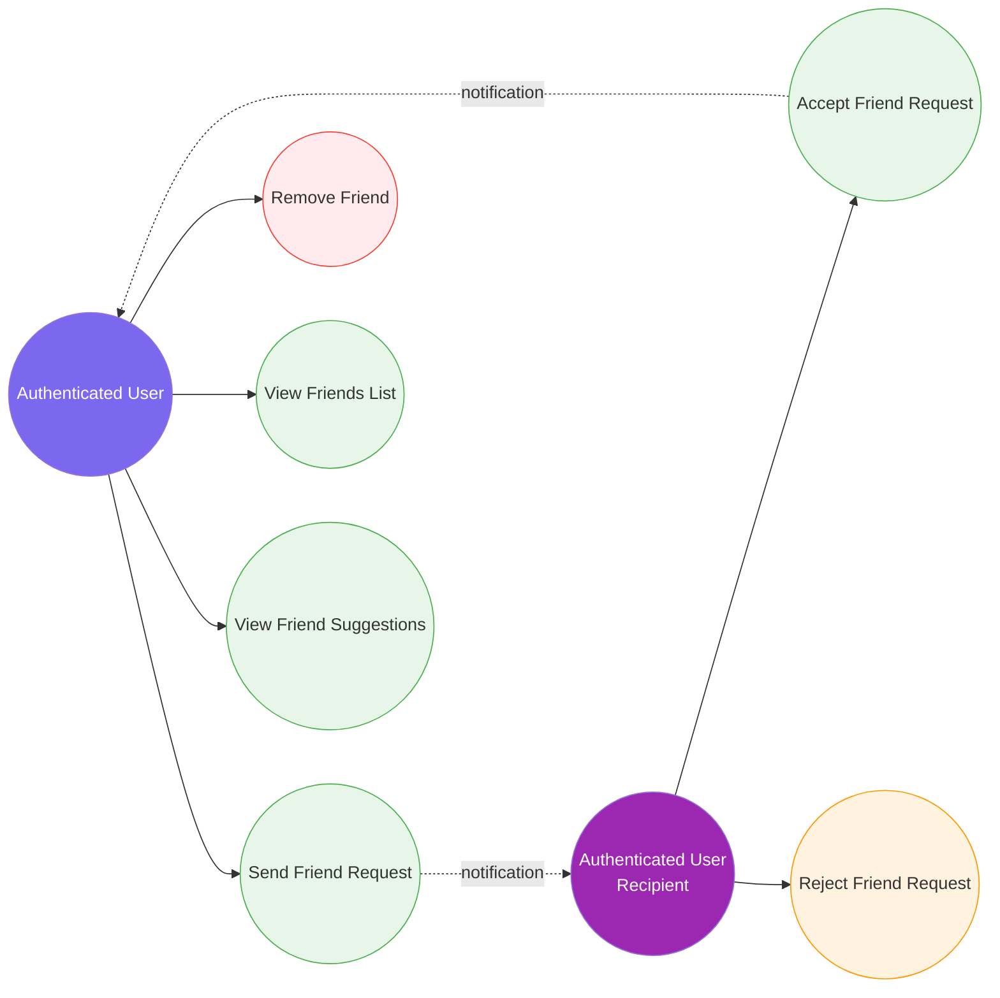

# 6. Friendship System

[← Back to Index](./README.md)

---

## UC-8.1 — Send Friend Request

| Field | Detail |
|-------|--------|
| **UC-ID** | UC-8.1 |
| **Title** | Send Friend Request |
| **Actor(s)** | Authenticated User |
| **Trigger** | User clicks "Add Friend" on another user's profile or suggestion card |

**Description:** The authenticated user sends a friend request to another user.

**Preconditions:** User is authenticated; target user exists; no existing friendship or pending request between the two.

**Main Success Flow:**
1. User navigates to another user's profile or sees a friend suggestion
2. User clicks "Add Friend"
3. Frontend sends a POST request to `api/friendship/request/{userId}`
4. System validates: no existing friendship, not self-request
5. System creates a `Friendship` entity with status `Pending`
6. System raises a `FriendRequestSentDomainEvent`
7. System dispatches a real-time notification to the target user
8. System returns success
9. Frontend updates button to "Request Sent" (pending state)

**Alternative Flows:**
- **4a. Already friends:** System returns an error
- **4b. Pending request exists:** System returns an error
- **4c. Self-request:** System returns a validation error

**Postconditions:** `Friendship` entity with `Pending` status exists; target user receives a notification.

**Business Rules:**
- `FriendshipStatus` enum: Pending, Accepted, Rejected, Blocked
- Creates a directional relationship (Requester → Addressee)
- Only one active friendship/request between any two users
- Domain events trigger notification delivery

---

## UC-8.2 — Accept Friend Request

| Field | Detail |
|-------|--------|
| **UC-ID** | UC-8.2 |
| **Title** | Accept Friend Request |
| **Actor(s)** | Authenticated User (request recipient) |
| **Trigger** | User clicks "Accept" on a pending friend request |

**Description:** The recipient of a friend request accepts it, establishing a mutual friendship.

**Preconditions:** User is authenticated; a pending friend request exists where the user is the addressee.

**Main Success Flow:**
1. User views their pending friend requests
2. User clicks "Accept"
3. Frontend sends a PUT request to `api/friendship/accept/{userId}`
4. System validates the friendship exists with `Pending` status
5. System updates status to `Accepted`
6. System raises a `FriendRequestAcceptedDomainEvent`
7. System dispatches a notification to the requester
8. System returns success
9. Frontend updates UI (removes from pending, adds to friends list)

**Alternative Flows:**
- **4a. Friendship not found:** System returns 404
- **4b. Already accepted:** System returns current state
- **4c. Not the addressee:** System returns 403

**Postconditions:** Friendship status is `Accepted`; both users appear in each other's friends list; requester notified.

**Business Rules:**
- Only the request recipient (addressee) can accept
- Accepting creates a bidirectional friendship

---

## UC-8.3 — Reject Friend Request

| Field | Detail |
|-------|--------|
| **UC-ID** | UC-8.3 |
| **Title** | Reject Friend Request |
| **Actor(s)** | Authenticated User (request recipient) |
| **Trigger** | User clicks "Reject" or "Decline" on a pending friend request |

**Description:** The recipient declines a pending friend request.

**Preconditions:** User is authenticated; a pending friend request exists where the user is the addressee.

**Main Success Flow:**
1. User views their pending friend requests
2. User clicks "Reject"
3. Frontend sends a PUT request to `api/friendship/reject/{userId}`
4. System validates the friendship exists with `Pending` status
5. System updates status to `Rejected`
6. System returns success
7. Frontend removes the request from the pending list

**Alternative Flows:**
- **4a. Friendship not found:** System returns 404
- **4c. Not the addressee:** System returns 403

**Postconditions:** Friendship status is `Rejected`; requester is not notified; new request can be sent later.

**Business Rules:**
- Only the addressee can reject
- Rejection does not notify the requester
- A new request can be sent after rejection

---

## UC-8.4 — Remove Friend

| Field | Detail |
|-------|--------|
| **UC-ID** | UC-8.4 |
| **Title** | Remove Friend |
| **Actor(s)** | Authenticated User |
| **Trigger** | User clicks "Unfriend" on a friend's profile or friends list |

**Description:** The authenticated user removes an existing friend from their friends list.

**Preconditions:** User is authenticated; an `Accepted` friendship exists between the two users.

**Main Success Flow:**
1. User navigates to a friend's profile or friends list
2. User clicks "Unfriend"
3. Frontend shows a confirmation dialog
4. User confirms
5. Frontend sends a DELETE request to `api/friendship/{userId}`
6. System validates the friendship exists with `Accepted` status
7. System deletes the `Friendship` entity
8. System returns success
9. Frontend updates UI (removes from friends list, changes button to "Add Friend")

**Alternative Flows:**
- **3a. User cancels:** No action
- **6a. Friendship not found:** System returns 404

**Postconditions:** Friendship removed; both users are no longer friends; both can send new requests.

**Business Rules:**
- Unfriending is bidirectional (both users lose the friendship)
- No notification is sent to the unfriended user

---

## UC-8.5 — View Friends List

| Field | Detail |
|-------|--------|
| **UC-ID** | UC-8.5 |
| **Title** | View Friends List |
| **Actor(s)** | Authenticated User |
| **Trigger** | User navigates to the friends section of a profile |

**Description:** The authenticated user views the list of friends for themselves or another user.

**Preconditions:** User is authenticated; the target user exists.

**Main Success Flow:**
1. User navigates to a profile and clicks "Friends" tab
2. Frontend sends a GET request to `api/friendship/{userId}` with pagination
3. System queries all `Accepted` friendships for the user
4. System returns a paginated list of friends with profile info
5. Frontend renders the friends list

**Alternative Flows:**
- **3a. No friends:** Frontend displays "No friends yet"

**Postconditions:** Friends list is displayed.

**Business Rules:**
- Only `Accepted` friendships are shown
- Results are paginated
- Both directions of friendship considered (sent and received)

---

## UC-8.6 — View Friend Suggestions

| Field | Detail |
|-------|--------|
| **UC-ID** | UC-8.6 |
| **Title** | View Friend Suggestions |
| **Actor(s)** | Authenticated User |
| **Trigger** | User views the suggestions section on the feed or profile |

**Description:** The system suggests users that the authenticated user may know or want to befriend.

**Preconditions:** User is authenticated.

**Main Success Flow:**
1. User navigates to the feed or a dedicated suggestions section
2. Frontend sends a GET request to `api/friendship/suggestions`
3. System queries users that are not already friends and have no pending requests
4. System returns a list of suggested users with profile info
5. Frontend renders suggestion cards with "Add Friend" buttons

**Alternative Flows:**
- **3a. No suggestions:** Frontend hides the section or displays "No suggestions"

**Postconditions:** User sees potential friends to add.

**Business Rules:**
- Excludes existing friends, pending requests, and self
- Results may be limited in number
- Suggestions could be based on mutual friends or random selection