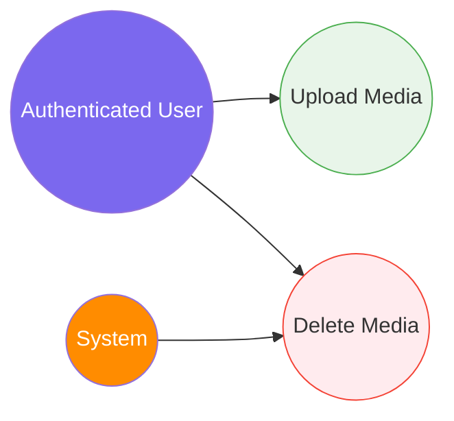

# 7. Media Management

[← Back to Index](./README.md)

---

## UC-9.1 — Upload Media

| Field | Detail |
|-------|--------|
| **UC-ID** | UC-9.1 |
| **Title** | Upload Media |
| **Actor(s)** | Authenticated User |
| **Trigger** | User attaches a file (image, video, etc.) to a post or profile |

**Description:** The authenticated user uploads a media file (image, video, audio, GIF) to the platform. Files are stored in Cloudinary and referenced by URL.

**Preconditions:** User is authenticated; file meets type and size requirements.

**Main Success Flow:**
1. User selects a file to upload (via file picker or drag-and-drop)
2. Frontend validates the file type and size client-side
3. Frontend sends a POST request (multipart/form-data) to `api/media/upload`
4. System uploads the file to Cloudinary via `CloudinaryDotNet` SDK
5. Cloudinary processes and stores the file
6. System returns a `CloudAsset` value object: `{ Url, PublicId, Type }`
7. Frontend stores the URL for use in post creation or profile update

**Alternative Flows:**
- **2a. Invalid file type:** Frontend shows a validation error immediately
- **2b. File too large:** Frontend shows a size limit error
- **4a. Cloudinary upload failure:** System returns a server error

**Postconditions:** File is stored in Cloudinary; `CloudAsset` with URL and PublicId is available.

**Business Rules:**
- Supported `MediaType` enum: Image, Video, Audio, Gif, Document
- File size limits vary by type (images smaller, videos larger)
- Uploads are authenticated (JWT required)
- Each media file gets a unique `PublicId` in Cloudinary

---

## UC-9.2 — Delete Media

| Field | Detail |
|-------|--------|
| **UC-ID** | UC-9.2 |
| **Title** | Delete Media |
| **Actor(s)** | Authenticated User (media owner), System |
| **Trigger** | User deletes a post with media, or system cleans up unused media |

**Description:** A media asset is deleted from Cloudinary when it is no longer needed (post deleted, avatar/cover replaced).

**Preconditions:** The media asset exists in Cloudinary (has a valid `PublicId`); user has permission to delete (owner).

**Main Success Flow:**
1. Trigger occurs (post deletion, avatar replacement, etc.)
2. System calls Cloudinary API to destroy the asset by `PublicId`
3. Cloudinary removes the file
4. System removes the `CloudAsset` reference from the database (if applicable)

**Alternative Flows:**
- **2a. Cloudinary deletion failure:** System logs the error; cleanup may be retried later

**Postconditions:** Media file removed from Cloudinary; database references updated.

**Business Rules:**
- Media deletion often happens as a side effect of other operations
- System may batch-delete orphaned media periodically
- Deletion is performed via Cloudinary's `DestroyAsync` API