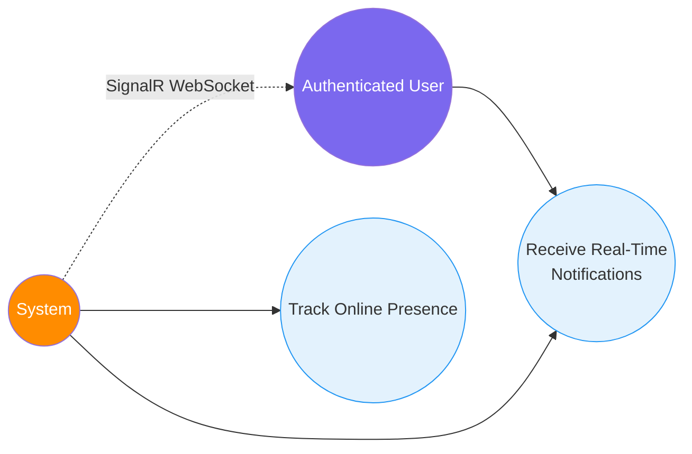

# 8. Real-Time Notifications & Presence

[← Back to Index](./README.md)

---

## UC-10.1 — Receive Real-Time Notifications

| Field | Detail |
|-------|--------|
| **UC-ID** | UC-10.1 |
| **Title** | Receive Real-Time Notifications |
| **Actor(s)** | Authenticated User |
| **Trigger** | An event occurs that concerns the user (comment on their post, friend request, reaction) |

**Description:** When a relevant social event occurs, the user receives a real-time notification via SignalR WebSocket connection.

**Preconditions:**
- User is authenticated and has an active WebSocket connection (SignalR)
- A triggering event has occurred

**Main Success Flow:**
1. User is browsing the application (SignalR connection is active)
2. A social event occurs:
   - Someone comments on the user's post (`CommentCreatedDomainEvent`)
   - Someone reacts to the user's post/comment
   - Someone sends a friend request (`FriendRequestSentDomainEvent`)
   - Someone accepts a friend request (`FriendRequestAcceptedDomainEvent`)
   - A new post is created by a friend (`PostCreatedDomainEvent`)
3. System processes the domain event via the outbox pattern
4. System dispatches a notification through the SignalR hub
5. Frontend receives the notification via the SignalR client
6. Frontend displays a notification toast/badge
7. User can click the notification to navigate to the relevant content

**Alternative Flows:**
- **1a. User offline:** Notification is stored in the database; shown when user reconnects
- **4a. SignalR connection lost:** System falls back to polling or queues the notification

**Postconditions:**
- User is informed of the event in real-time
- `Notification` entity is persisted in the database for history

**Business Rules:**
- Notifications are delivered via SignalR WebSocket (Redis backplane for scaling)
- `NotificationType` enum defines notification categories
- Notifications reference a target entity (post, comment, friendship, user)
- Outbox pattern ensures reliable event delivery (no lost notifications)
- Users don't receive notifications for their own actions

---

## UC-10.2 — Track Online Presence

| Field | Detail |
|-------|--------|
| **UC-ID** | UC-10.2 |
| **Title** | Track Online Presence |
| **Actor(s)** | System, Authenticated User |
| **Trigger** | User connects or disconnects from SignalR hub |

**Description:** The system tracks which users are currently online and makes this information available to other users (e.g., on friend lists, chat indicators).

**Preconditions:** User is authenticated.

**Main Success Flow:**
1. User authenticates and the frontend establishes a SignalR connection
2. System registers the user as "online" in Redis
3. When the user disconnects (closes tab, navigates away), system marks them as "offline"
4. Other users can see online/offline status indicators on profiles and friend lists
5. System broadcasts presence changes to connected clients

**Alternative Flows:**
- **2a. Connection drops temporarily:** System uses heartbeat/timeout to determine actual disconnect
- **5a. Multiple tabs/devices:** System tracks connection count; user is online if at least one connection is active

**Postconditions:**
- Online status is accurately reflected in the UI
- Presence data is stored in Redis for fast access

**Business Rules:**
- Online status is stored in Redis (key-value with TTL)
- Status updates are broadcast via SignalR
- Presence is ephemeral (not persisted in PostgreSQL)