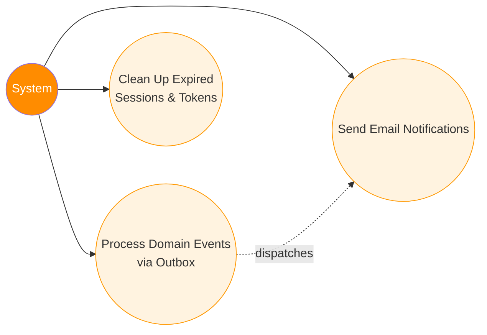

# 9. Background Processing & Events

[← Back to Index](./README.md)

---

## UC-11.1 — Process Domain Events via Outbox Pattern

| Field | Detail |
|-------|--------|
| **UC-ID** | UC-11.1 |
| **Title** | Process Domain Events via Outbox Pattern |
| **Actor(s)** | System |
| **Trigger** | Domain event is raised during a command operation |

**Description:** Domain events raised during business operations are reliably processed using the Outbox pattern to ensure eventual consistency and side-effect delivery.

**Preconditions:**
- A domain event has been raised by an aggregate root
- The associated database transaction has been committed

**Main Success Flow:**
1. A command handler modifies an aggregate root (Post, Comment, Friendship, etc.)
2. Aggregate root raises a domain event and adds it to its event collection
3. EF Core `SaveChanges` interceptor serializes the event into an `OutboxMessage` entity
4. `OutboxMessage` is saved in the same database transaction as the business data
5. Transaction is committed
6. Hangfire background job polls the Outbox table for unprocessed messages
7. Background job dispatches the event via MediatR pipeline
8. Event handlers process the event (send notifications, update read models, etc.)
9. `OutboxMessage` is marked as processed

**Alternative Flows:**
- **6a. Processing failure:** Message remains unprocessed; retry on next poll
- **8a. Handler failure:** Message is marked with error; retry with exponential backoff

**Postconditions:**
- Domain event is processed
- Side effects are executed (notifications, emails, etc.)
- Outbox message is marked as processed

**Business Rules:**
- Events and business data share the same transaction (atomicity)
- Outbox messages have: `Id`, `Type`, `Content` (JSON), `OccurredOnUtc`, `ProcessedOnUtc`, `Error`
- Failed messages are retried with backoff
- This pattern guarantees at-least-once delivery

---

## UC-11.2 — Send Email Notifications

| Field | Detail |
|-------|--------|
| **UC-ID** | UC-11.2 |
| **Title** | Send Email Notifications |
| **Actor(s)** | System |
| **Trigger** | User registers or requests password reset |

**Description:** The system sends transactional emails (confirmation, password reset) via background jobs.

**Preconditions:**
- An email-sending event has been triggered
- SMTP configuration is available

**Main Success Flow:**
1. A command handler enqueues an email job via `IJobService` (Hangfire)
2. Hangfire worker picks up the job
3. Job renders the email content from a template
4. Job sends the email via `IEmailService` (SMTP)
5. Job is marked as completed

**Alternative Flows:**
- **4a. SMTP failure:** Hangfire retries the job automatically (configured retry policy)

**Postconditions:** Email is delivered to the user's inbox.

**Business Rules:**
- Emails include: registration confirmation, password reset
- Templates are rendered server-side
- Hangfire provides automatic retry with configurable retry count
- Email jobs are fire-and-forget (non-blocking for the API request)

---

## UC-11.3 — Clean Up Expired Sessions & Tokens

| Field | Detail |
|-------|--------|
| **UC-ID** | UC-11.3 |
| **Title** | Clean Up Expired Sessions & Tokens |
| **Actor(s)** | System |
| **Trigger** | Scheduled background job runs periodically |

**Description:** The system periodically cleans up expired refresh tokens, old outbox messages, and stale data.

**Preconditions:** Scheduled job is configured in Hangfire.

**Main Success Flow:**
1. Hangfire triggers the cleanup job on schedule
2. System queries for expired refresh tokens and removes them
3. System queries for processed outbox messages older than a threshold and removes them
4. Job completes

**Alternative Flows:**
- **2a. Cleanup failure:** Job is retried by Hangfire

**Postconditions:** Database is cleaned of expired data; storage usage is optimized.

**Business Rules:**
- Cleanup runs on a configurable schedule (e.g., daily)
- Only processed outbox messages are cleaned (unprocessed are preserved)
- Expired refresh tokens are safe to remove