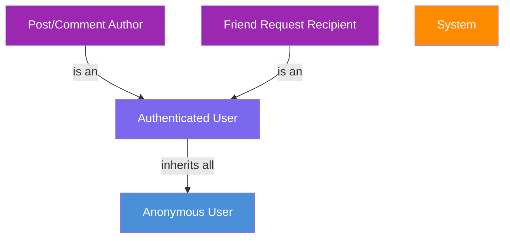

# SocialFlow — Use Cases Document

> **Version:** 1.0  
> **Last Updated:** April 2026  
> **Project:** SocialFlow — Social Network Platform  
> **Architecture:** Clean Architecture (Backend: ASP.NET Core + CQRS/MediatR | Frontend: React + TypeScript)

---

## Table of Contents

| # | Document | Use Cases | Description |
|---|----------|-----------|-------------|
| 1 | [Authentication & Account Management](./01-authentication.md) | 7 | Register, Login, Logout, Confirm Email, Refresh Token, Forgot/Reset Password |
| 2 | [User Profile Management](./02-profile-management.md) | 4 | View Profile, Update Profile, Upload Avatar, Upload Cover Photo |
| 3 | [Post Management (News Feed)](./03-post-management.md) | 5 | Create, View Feed, View Detail, Update, Delete Posts |
| 4 | [Comment Management](./04-comment-management.md) | 4 | Create, View, Update, Delete Comments |
| 5 | [Reaction System](./05-reaction-system.md) | 3 | React, Remove Reaction, View Reactions Summary |
| 6 | [Friendship System](./06-friendship-system.md) | 6 | Send/Accept/Reject Request, Remove Friend, View Friends, Suggestions |
| 7 | [Media Management](./07-media-management.md) | 2 | Upload and Delete Media |
| 8 | [Real-Time Notifications & Presence](./08-realtime-notifications.md) | 2 | SignalR Notifications, Online Presence |
| 9 | [Background Processing & Events](./09-background-processing.md) | 3 | Outbox Pattern, Email Jobs, Cleanup |
| A | [Appendices](./appendices.md) | — | Summary Matrix, Domain Events, Tech Stack, Full Diagram |

**Total Use Cases: 35**

---

## Introduction

SocialFlow enables users to create accounts, build profiles, publish posts with media, interact through comments and reactions, manage friendships, and receive real-time notifications.

The platform follows a **Clean Architecture** with:
- **Backend:** ASP.NET Core Web API, CQRS pattern (MediatR), Entity Framework Core (PostgreSQL), Redis caching, SignalR real-time, Cloudinary media storage, Hangfire background jobs, Outbox pattern for domain events.
- **Frontend:** React with TypeScript, React Router, TanStack Query, Zustand state management, Zod validation, Axios HTTP client.

---

## Actors

| Actor | Description |
|-------|-------------|
| **Anonymous User** | A visitor who has not authenticated. Can access login, register, forgot/reset password, and confirm email pages. |
| **Authenticated User** | A logged-in user who can create posts, comment, react, manage friendships, update their profile, and consume the news feed. |
| **Post/Comment Author** | An authenticated user performing actions on content they authored (edit, delete). |
| **Friend Request Recipient** | An authenticated user who is the target of a friend request (accept, reject). |
| **System** | Automated background processes (email delivery, event processing, token refresh, notification dispatch via SignalR). |

### Actor Hierarchy

### Color Legend

| Color | Meaning |
|-------|---------|
| 🟩 Green border | Read / Create use cases |
| 🟧 Orange border | Update use cases |
| 🟥 Red border | Delete use cases |
| 🔵 Blue border | Real-time / Infrastructure use cases |