# Appendices

[← Back to Index](./README.md)

---

## Appendix A: Use Case Summary Matrix

| UC-ID | Title | Actor(s) | Feature Area |
|-------|-------|----------|-------------|
| UC-3.1 | Register New Account | Anonymous User | Authentication |
| UC-3.2 | Login | Anonymous User | Authentication |
| UC-3.3 | Logout | Authenticated User | Authentication |
| UC-3.4 | Confirm Email Address | Anonymous User | Authentication |
| UC-3.5 | Refresh Access Token | System | Authentication |
| UC-3.6 | Forgot Password | Anonymous User | Authentication |
| UC-3.7 | Reset Password | Anonymous User | Authentication |
| UC-4.1 | View User Profile | Authenticated User | Profile Management |
| UC-4.2 | Update User Profile | Authenticated User | Profile Management |
| UC-4.3 | Upload Avatar Image | Authenticated User | Profile Management |
| UC-4.4 | Upload Cover Photo | Authenticated User | Profile Management |
| UC-5.1 | Create Post | Authenticated User | Post Management |
| UC-5.2 | View News Feed | Authenticated User | Post Management |
| UC-5.3 | View Post Detail | Authenticated User | Post Management |
| UC-5.4 | Update Post | Authenticated User (Author) | Post Management |
| UC-5.5 | Delete Post | Authenticated User (Author) | Post Management |
| UC-6.1 | Create Comment | Authenticated User | Comment Management |
| UC-6.2 | View Comments for a Post | Authenticated User | Comment Management |
| UC-6.3 | Update Comment | Authenticated User (Author) | Comment Management |
| UC-6.4 | Delete Comment | Authenticated User (Author) | Comment Management |
| UC-7.1 | React to Post or Comment | Authenticated User | Reaction System |
| UC-7.2 | Remove Reaction | Authenticated User | Reaction System |
| UC-7.3 | View Reactions Summary | Authenticated User | Reaction System |
| UC-8.1 | Send Friend Request | Authenticated User | Friendship System |
| UC-8.2 | Accept Friend Request | Authenticated User | Friendship System |
| UC-8.3 | Reject Friend Request | Authenticated User | Friendship System |
| UC-8.4 | Remove Friend | Authenticated User | Friendship System |
| UC-8.5 | View Friends List | Authenticated User | Friendship System |
| UC-8.6 | View Friend Suggestions | Authenticated User | Friendship System |
| UC-9.1 | Upload Media | Authenticated User | Media Management |
| UC-9.2 | Delete Media | Authenticated User / System | Media Management |
| UC-10.1 | Receive Real-Time Notifications | Authenticated User | Real-Time |
| UC-10.2 | Track Online Presence | System | Real-Time |
| UC-11.1 | Process Domain Events (Outbox) | System | Background Processing |
| UC-11.2 | Send Email Notifications | System | Background Processing |
| UC-11.3 | Clean Up Expired Sessions & Tokens | System | Background Processing |

**Total Use Cases: 35**

---

## Appendix B: Domain Events Reference

| Domain Event | Trigger | Side Effects |
|-------------|---------|-------------|
| `PostCreatedDomainEvent` | New post created | Notify followers, update feed caches |
| `CommentCreatedDomainEvent` | New comment created | Notify post author, update comment count |
| `FriendRequestSentDomainEvent` | Friend request sent | Notify target user |
| `FriendRequestAcceptedDomainEvent` | Friend request accepted | Notify requester, update friends list |

---

## Appendix C: Technology Stack Reference

| Layer | Technology |
|-------|-----------|
| **Backend API** | ASP.NET Core Web API |
| **CQRS** | MediatR (Commands, Queries, Handlers) |
| **Database** | PostgreSQL (EF Core ORM) |
| **Caching** | Redis (distributed cache, SignalR backplane) |
| **Real-Time** | SignalR (WebSocket) |
| **Background Jobs** | Hangfire (Redis storage) |
| **Media Storage** | Cloudinary (images, videos, audio) |
| **Authentication** | ASP.NET Identity + JWT Bearer |
| **Validation** | FluentValidation (backend), Zod (frontend) |
| **Frontend** | React 18+ with TypeScript |
| **State Management** | Zustand |
| **Data Fetching** | TanStack Query (React Query) |
| **HTTP Client** | Axios (with interceptors for token refresh) |
| **Routing** | React Router v6 |
| **UI Components** | Radix UI + Tailwind CSS (shadcn/ui) |

---

## Appendix D: Comprehensive Use Case Diagram

The following Mermaid diagram provides a complete overview of all actors and their use cases across the entire SocialFlow platform:

```mermaid
graph LR
    %% Actors
    ANON((Anonymous User))
    AUTH((Authenticated User))
    AUTHOR((Post/Comment<br/>Author))
    RECIPIENT((Friend Request<br/>Recipient))
    SYS((System))

    %% Authentication
    UC31((UC-3.1<br/>Register))
    UC32((UC-3.2<br/>Login))
    UC33((UC-3.3<br/>Logout))
    UC34((UC-3.4<br/>Confirm Email))
    UC35((UC-3.5<br/>Refresh Token))
    UC36((UC-3.6<br/>Forgot Password))
    UC37((UC-3.7<br/>Reset Password))

    %% Profile
    UC41((UC-4.1<br/>View Profile))
    UC42((UC-4.2<br/>Update Profile))
    UC43((UC-4.3<br/>Upload Avatar))
    UC44((UC-4.4<br/>Upload Cover))

    %% Posts
    UC51((UC-5.1<br/>Create Post))
    UC52((UC-5.2<br/>View Feed))
    UC53((UC-5.3<br/>Post Detail))
    UC54((UC-5.4<br/>Update Post))
    UC55((UC-5.5<br/>Delete Post))

    %% Comments
    UC61((UC-6.1<br/>Create Comment))
    UC62((UC-6.2<br/>View Comments))
    UC63((UC-6.3<br/>Update Comment))
    UC64((UC-6.4<br/>Delete Comment))

    %% Reactions
    UC71((UC-7.1<br/>React))
    UC72((UC-7.2<br/>Remove Reaction))
    UC73((UC-7.3<br/>Reactions Summary))

    %% Friendship
    UC81((UC-8.1<br/>Send Request))
    UC82((UC-8.2<br/>Accept Request))
    UC83((UC-8.3<br/>Reject Request))
    UC84((UC-8.4<br/>Remove Friend))
    UC85((UC-8.5<br/>View Friends))
    UC86((UC-8.6<br/>Suggestions))

    %% Media
    UC91((UC-9.1<br/>Upload Media))
    UC92((UC-9.2<br/>Delete Media))

    %% Real-time
    UC101((UC-10.1<br/>Notifications))
    UC102((UC-10.2<br/>Online Presence))

    %% Background
    UC111((UC-11.1<br/>Outbox Events))
    UC112((UC-11.2<br/>Email Jobs))
    UC113((UC-11.3<br/>Cleanup))

    %% Actor connections - Authentication
    ANON --> UC31
    ANON --> UC32
    ANON --> UC34
    ANON --> UC36
    ANON --> UC37
    AUTH --> UC33
    SYS --> UC35

    %% Actor connections - Profile
    AUTH --> UC41
    AUTH --> UC42
    AUTH --> UC43
    AUTH --> UC44

    %% Actor connections - Posts
    AUTH --> UC51
    AUTH --> UC52
    AUTH --> UC53
    AUTHOR --> UC54
    AUTHOR --> UC55

    %% Actor connections - Comments
    AUTH --> UC61
    AUTH --> UC62
    AUTHOR --> UC63
    AUTHOR --> UC64

    %% Actor connections - Reactions
    AUTH --> UC71
    AUTH --> UC72
    AUTH --> UC73

    %% Actor connections - Friendship
    AUTH --> UC81
    RECIPIENT --> UC82
    RECIPIENT --> UC83
    AUTH --> UC84
    AUTH --> UC85
    AUTH --> UC86

    %% Actor connections - Media
    AUTH --> UC91
    AUTH --> UC92
    SYS --> UC92

    %% Actor connections - Real-time
    AUTH --> UC101
    SYS --> UC101
    SYS --> UC102

    %% Actor connections - Background
    SYS --> UC111
    SYS --> UC112
    SYS --> UC113

    %% Styles
    style ANON fill:#4A90D9,color:#fff
    style AUTH fill:#7B68EE,color:#fff
    style AUTHOR fill:#9C27B0,color:#fff
    style RECIPIENT fill:#9C27B0,color:#fff
    style SYS fill:#FF8C00,color:#fff

    style UC31 fill:#E8F5E9,stroke:#4CAF50
    style UC32 fill:#E8F5E9,stroke:#4CAF50
    style UC33 fill:#E8F5E9,stroke:#4CAF50
    style UC34 fill:#E8F5E9,stroke:#4CAF50
    style UC35 fill:#FFF3E0,stroke:#FF9800
    style UC36 fill:#E8F5E9,stroke:#4CAF50
    style UC37 fill:#E8F5E9,stroke:#4CAF50

    style UC41 fill:#E8F5E9,stroke:#4CAF50
    style UC42 fill:#E8F5E9,stroke:#4CAF50
    style UC43 fill:#E8F5E9,stroke:#4CAF50
    style UC44 fill:#E8F5E9,stroke:#4CAF50

    style UC51 fill:#E8F5E9,stroke:#4CAF50
    style UC52 fill:#E8F5E9,stroke:#4CAF50
    style UC53 fill:#E8F5E9,stroke:#4CAF50
    style UC54 fill:#FFF3E0,stroke:#FF9800
    style UC55 fill:#FFEBEE,stroke:#F44336

    style UC61 fill:#E8F5E9,stroke:#4CAF50
    style UC62 fill:#E8F5E9,stroke:#4CAF50
    style UC63 fill:#FFF3E0,stroke:#FF9800
    style UC64 fill:#FFEBEE,stroke:#F44336

    style UC71 fill:#E8F5E9,stroke:#4CAF50
    style UC72 fill:#FFF3E0,stroke:#FF9800
    style UC73 fill:#E8F5E9,stroke:#4CAF50

    style UC81 fill:#E8F5E9,stroke:#4CAF50
    style UC82 fill:#E8F5E9,stroke:#4CAF50
    style UC83 fill:#FFF3E0,stroke:#FF9800
    style UC84 fill:#FFEBEE,stroke:#F44336
    style UC85 fill:#E8F5E9,stroke:#4CAF50
    style UC86 fill:#E8F5E9,stroke:#4CAF50

    style UC91 fill:#E8F5E9,stroke:#4CAF50
    style UC92 fill:#FFEBEE,stroke:#F44336

    style UC101 fill:#E3F2FD,stroke:#2196F3
    style UC102 fill:#E3F2FD,stroke:#2196F3

    style UC111 fill:#FFF3E0,stroke:#FF9800
    style UC112 fill:#FFF3E0,stroke:#FF9800
    style UC113 fill:#FFF3E0,stroke:#FF9800
```

### Legend

| Color | Meaning |
|-------|---------|
| 🟦 Blue | Anonymous User actor |
| 🟪 Purple | Authenticated User actor |
| 🟣 Dark Purple | Specialized actor (Author, Recipient) |
| 🟧 Orange | System actor |
| 🟩 Green border | Read / Create use cases |
| 🟧 Orange border | Update use cases |
| 🟥 Red border | Delete use cases |
| 🔵 Blue border | Real-time / Infrastructure use cases |